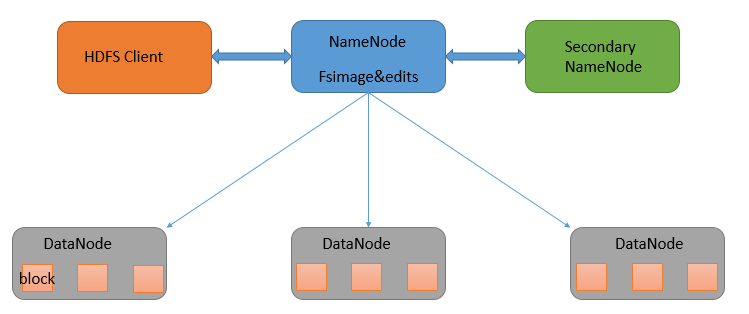
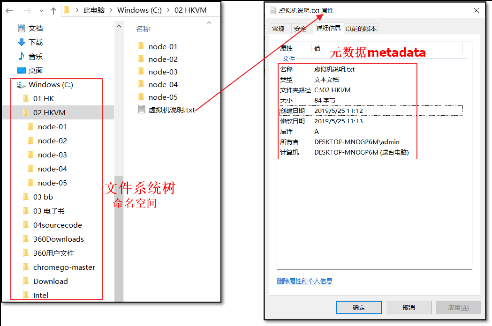
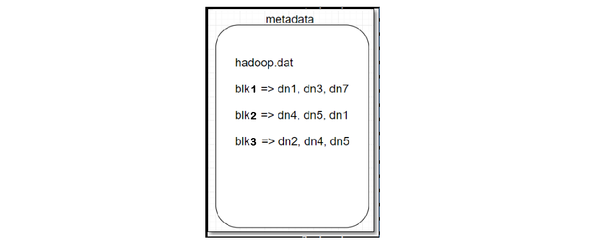
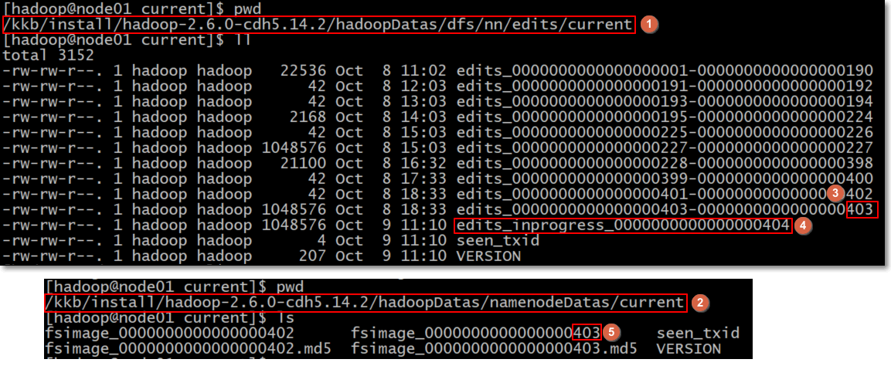

	## 	HDFS 架构

> HDFS 架构图

  - 大多数分布式框架都是主从架构
  - HDFS 也是  主从架构 Master |  Slave 或称为管理节点   |  工作节点

1. NameNode 

   1.1 文件系统

   - file system 文件系统： 操作系统中负责管理和存储文件信息的软件; 具体地说， 它负责为用户创建文件，存入，修改，转储，删除文件等。

   - 读文件 ----> 找到文件 ----> 在哪  +  叫啥 ？

   - 元数据

     - 关于文件或目录的描述信息，如文件所在路径、文件名称、文件类型等等，这些信息称为文件的元数据（metadata）

   - 命名空间

     - 文件系统中，为了便于管理存储介质上的，给每个目录、目录中的文件、子目录都起了名字，这样形成的层级结构，称之为命名空间

     - 同一个目录中，不能有同名的文件或目录

     - 这样通过目录 + 文件名的方式能够唯一的定位一个文件

       

   1.2 HDFS-NameNode

   - HDFS 本质上也是文件系统 filesystem , 所以也有元数据（metadata）

   - 元数据(metadata)保存在NameNode 内存中

   - NameNode 作用

     - HDFS 的主节点，负责管理文件系统的命名空间，将HDFS 的元数据存储在NameNode 节点的内存中
     - 负责响应客户端对文件的读写请求

   - HDFS 元数据

     - 文件目录树、所有的文件（目录）名称、文件属性（生成时间、副本、权限）、每个文件的块列表、每个block块所在的datanode 列表

       

   - 每个文件、目录、block 占用大概 **150 Byte字节的元数据**；所以HDFS适合存储大文件，不适合存储小文件

   -  HDFS 元数据信息以两种形式保存： 

     1. 编辑日志**edits log**
     2. 命名空间镜像文件**fsimage**

     - edits log : HDFS 编辑日志文件，保存客户端对HDFS的所有更改记录，如增、删、重命名文件（目录）；这些操作会修改HDFS 目录树；NameNode 会在编辑日志 edit 日志中记录下来；

     - fsimage : HDFS 元数据镜像文件，即将 namenode 内存中的数据落入磁盘生成的文件；保存了文件系统目录树信息以及文件、块、datanode 的映射关系。如下图：

       

     > 说明：
     >
     > 1. 为 hdfs-site.xml 中属性 dfs.namenode.edits.dir 的值决定；用于namenode 保存 edits.log 文件
     > 2. 为 hdfs-site.xml 中属性 dfs.namenode.deits.dir 的值决定；用于namenode 保存 fsimage 文件

2. DataNode
   - DataNode 数据节点的作用
     - 存储block 以及block 元数据到 datanode 本地磁盘；此处的元数据包括数据的长度、块数据的校验和、时间戳
     - 
3. 
4. 
5. 
6. 

​     

​     

​     

​     

​     

​     

​     

​     

​     

  
