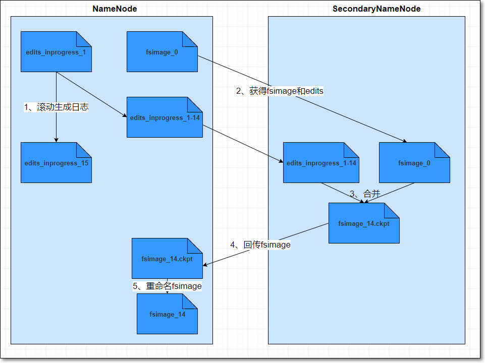
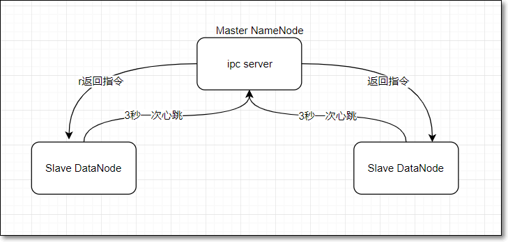
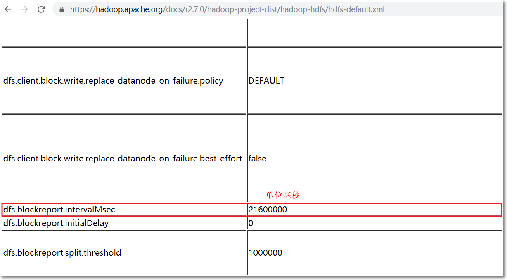
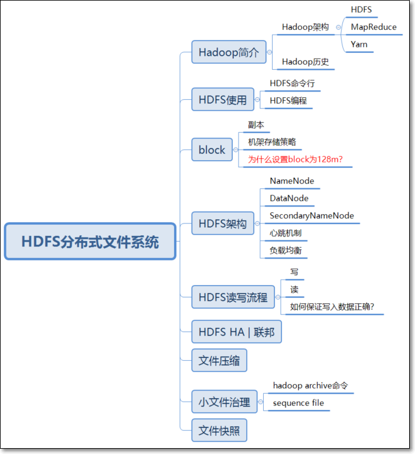

	## 	HDFS 架构

> HDFS 架构图


  - 大多数分布式框架都是主从架构
  - HDFS 也是  主从架构 Master |  Slave 或称为管理节点   |  工作节点

1. NameNode 

   1.1 文件系统

   - file system 文件系统： 操作系统中负责管理和存储文件信息的软件; 具体地说， 它负责为用户创建文件，存入，修改，转储，删除文件等。

   - 读文件 ----> 找到文件 ----> 在哪  +  叫啥 ？

   - 元数据

     - 关于文件或目录的描述信息，如文件所在路径、文件名称、文件类型等等，这些信息称为文件的元数据（metadata）

   - 命名空间

     - 文件系统中，为了便于管理存储介质上的，给每个目录、目录中的文件、子目录都起了名字，这样形成的层级结构，称之为命名空间

     - 同一个目录中，不能有同名的文件或目录

     - 这样通过目录 + 文件名的方式能够唯一的定位一个文件

       

   1.2 HDFS-NameNode

   - HDFS 本质上也是文件系统 filesystem , 所以也有元数据（metadata）

   - 元数据(metadata)保存在NameNode 内存中

   - NameNode 作用

     - HDFS 的主节点，负责管理文件系统的命名空间，将HDFS 的元数据存储在NameNode 节点的内存中
     - 负责响应客户端对文件的读写请求

   - HDFS 元数据

     - 文件目录树、所有的文件（目录）名称、文件属性（生成时间、副本、权限）、每个文件的块列表、每个block块所在的datanode 列表

       

   - 每个文件、目录、block 占用大概 **150 Byte字节的元数据**；所以HDFS适合存储大文件，不适合存储小文件

   -  HDFS 元数据信息以两种形式保存： 

     1. 编辑日志**edits log**
     2. 命名空间镜像文件**fsimage**

     - edits log : HDFS 编辑日志文件，保存客户端对HDFS的所有更改记录，如增、删、重命名文件（目录）；这些操作会修改HDFS 目录树；NameNode 会在编辑日志 edit 日志中记录下来；

     - fsimage : HDFS 元数据镜像文件，即将 namenode 内存中的数据落入磁盘生成的文件；保存了文件系统目录树信息以及文件、块、datanode 的映射关系。如下图：

       

     > 说明：
     >
     > 1. 为 hdfs-site.xml 中属性 dfs.namenode.edits.dir 的值决定；用于namenode 保存 edits.log 文件
     > 2. 为 hdfs-site.xml 中属性 dfs.namenode.deits.dir 的值决定；用于namenode 保存 fsimage 文件

2. DataNode
   - DataNode 数据节点的作用
     - 存储block 以及block 元数据到 datanode 本地磁盘；此处的元数据包括数据的长度、块数据的校验和、时间戳
   
3. SeconddaryNameNode

   - 为什么元数据引入SeconddaryNameNode

     - 为什么元数据存储在NameNode的内存中？

     - 这样做有什么问题？如何解决？

       - HDFS编辑日志文件 editlog ：在NameNode节点中的编辑editlog 中，记录下来客户端对HDFS的所有更改的记录、如增、删、重命名文件（目录）

       - 作用： 一旦系统出故障， 可以从editlog 进行恢复；

       - 但 爱editlog 日志大小会随着时间变在越来越大，导致系统重启根据日志恢复的时候会越来越长；

       - 为了避免这种情况 ，引入**检查点机制 checkpoint** ,命名空间镜像 fsimage 就是HDFS元数据的持久性检查点，即将内存中的元数据落磁盘生成的文件；

       - 此时， namenode 如果重启，可将磁盘中的fsimage 文件读入内容，将元数据恢复到某一个检查点，即将内存中的元数据在磁盘生成的文件；

       - 此时，namenode如果重启，可以将磁盘中和fsimage 文件读入内容，将元数据恢复到某一个检查点，然后再执行检查点之后记录的编辑日志，最后完全恢复元数据。

       - 但是依然，随着时间的推移，editlog 记录的日志会变多，寻么当namenode 重启，恢复元数据过程中，会花越来越长的时间执行editlog中的每一个日志；而在namenode 元数据恢复期间，HDFS不可用。

       - 为了解决问题，引入 secondarynamenode 辅助 namenode , 用来合并 fsimage 及 editlog

         

       

   - SecondaryNameNode 定期做checkpoint 检查点操作

     - 创建检查点 checkpoint 的两个条件：
       - SecondaryNamenode 每隔一个小时创建一个检查点
       - 另外，SecondaryNamenode 每一分钟检查一次，从上一次检查点开始，edits 日志文件中是否已包括 100万个事务，如果是，也会创建检查点
     - Secondary NameNode 首先请求原 NameNode 进行edit 进行 edits 的滚动，这样新的编辑操作能够进入新的文件中
     - Secondary NameNode 通过 HTTP PUT 方式将新的 fsimage 发送到原 NameNode
     - 原 NameNode 用新的fsimage 替换旧的 fsimage , 同时系统会更新 fsimage 文件到记录检查点的时间。
     - 这个过程结束后，NameNode 就有了最新的 fsimage 文件和更小的 edits 文件。

   - SecondaryNameNode 一般部署在另外一台节点上

     - 因为它需要占用大量的CPU时间
     - 并需要与 namenode 一样多的内存，来执行合并操作

   - 如何查看 edits 日志文件

     ```xml
     hdfs oev -i edits_0000000000256-00000000000000363 -o /home/hadoop/edit1.xml	
     ```

     

   - 如何查看 fsimage 文件

     ```xml
     hdfs oiv -p XML -i fsimage_000000000000092691 -o fsimage.xml
     ```

     

   - checkpoint 相关属性

     | 属性                                 | 值              | 解释                                                         |
     | ------------------------------------ | --------------- | ------------------------------------------------------------ |
     | dfs.namenode.checkpoint.period       | 3600秒(即1小时) | The number of seconds between two periodic checkpoints.      |
     | dfs.namenode.checkpoint.txns         | 1000000         | The Secondary NameNode or CheckpointNode will create a checkpoint of the namespace every 'dfs.namenode.checkpoint.txns' transactions, regardless of whether 'dfs.namenode.checkpoint.period' has expired. |
     | dfs.namenode.checkpoint.check.period | 60(1分钟)       | The SecondaryNameNode and CheckpointNode will poll the NameNode every 'dfs.namenode.checkpoint.check.period' seconds to query the number of uncheckpointed transactions. |

4. 心跳机制

   

   **工作原理**

   1. NameNode 启动的时候，会开一个 ipc server 在那里
   2. DataNode 启动后向NameNode 注册，每隔三秒种 向NameNode 发送一个“**心跳 heartbeat**”
   3. 心跳返回结果带有 NameNode 给该 DataNode 的命令，如复制块数据到另一个 DataNode， 或删除某个数据块
   4. 如果超时10 分钟 NameNode 没有收到某个 DataNode 的心跳，则认为该DataNode 节点不可用
   5. DataNode 周期性（6 小时）的向NameNode 上报当前 DataNode 上的块状态报告 BlockReport ; 块状态报告包含了一个该 DataNode 上所有的数据块的列表

   **心跳的作用**

   1. 通过周期心跳，NameNode可以向DataNode返回指令
   2. 可以判断DataNode是否在线
   3. 通过BlockReport , NameNode 能够知道各DataNode 的存储情况，如磁盘利用率、块列表；跟负载均衡有关
   4. hadoop 集群刚开始启动时， 99.9 % 的block 没有达到最小副本数（dfs.namenode.replication.min 默认值为1），集群处于安全模式，涉及 BlockReport；

   **心跳相关配置**

   - [hdfs-default.xml](<https://hadoop.apache.org/docs/r2.7.0/hadoop-project-dist/hadoop-hdfs/hdfs-default.xml>)

   - 心跳间隔

     | 属性                   | 值   | 解释                                               |
     | ---------------------- | ---- | -------------------------------------------------- |
     | dfs.heartbeat.interval | 3    | Determines datanode heartbeat interval in seconds. |

     - **block report**

     | More Actions属性             | 值               | 解释                                                 |
     | ---------------------------- | ---------------- | ---------------------------------------------------- |
     | dfs.blockreport.intervalMsec | 21600000 (6小时) | Determines block reporting interval in milliseconds. |

   - 查看`hdfs-default.xml`默认配置文件

     

     

5.  负载均衡

   - 什么原因会有可能造成不均衡？

     - 机器与机器之间磁盘利用率不平衡是HDFS集群非常容易出现的情况
     - 尤其是在DataNode节点出现故障或在现有的集群上增添新的 DataNode 的时候

   - 为什么需要均衡？

     - 提升集群存储资源利用率
     - 从存储与计算两方面提高集群性能

   - 如何手动负载均衡？

     ```shell
     $HADOOP_HOME/sbin/start-balancer.sh -t 5% #磁盘利用率最高的节点若比最少的节点,大于5%,触发均衡
     ```

     

6.  小结 

   - NameNode负责存储元数据，存在内存中
   - DataNode负责存储block块及块的元数据
   - SecondaryNameNode主要负责对HDFS元数据做checkpoint操作
   - 集群的心跳机制，让集群中各节点形成一个整体；主节点知道从节点的死活
   - 节点的上下线，导致存储的不均衡，可以手动触发负载均衡

​     

​     

​     

​     

​     

​     

​     

​     

​     

  
