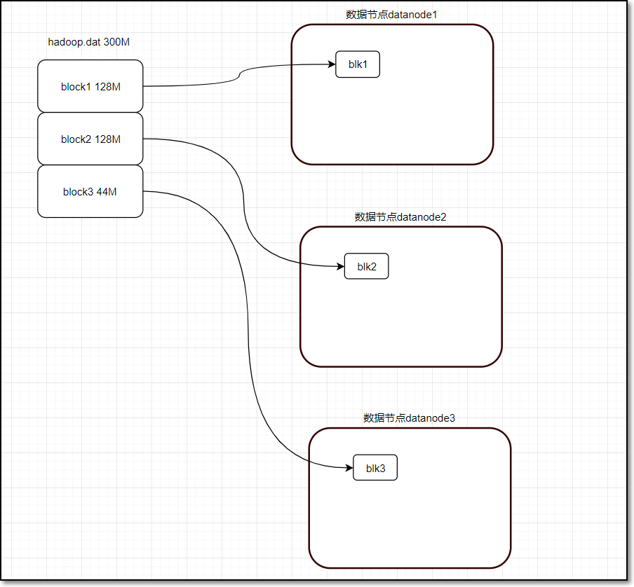
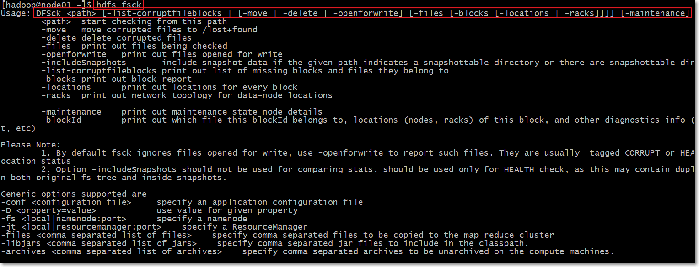
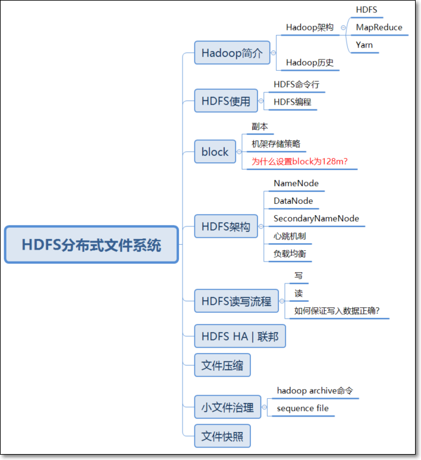

<<<<<<< HEAD:hadoop/HDFS/数据块 block.md
### 数据块 block 

1.  HDFS block 块

   - 向HDFS 上传文件，是按照128M 为单位，切分成一个个block , 分散的存储在集群的不同数据节点 datanode 上。

   - 问：  HDFS 中一个44M 大小的块会不会占据128M的空间？

     - 小于一个块大小的文件不会占据整个块的空间

   - 问： 这样存储有没有问题 ?

     

2. block 副本

   - 因为HDFS是用普通的商用服务器搭建起来的，所以有节点出问题的可能性;

   - 那么如果每个 block 只有一份的话，当 block 所在的节点宕机后，此 block 将无法访问，进而导致文件无法完整读取。

   - 为保证数据的可用及容错，HDFS 设计成每个 block  共有三份，即三个副本

   - 如何设置副本数？

     - replicatiion =3

     hdfs-site.xml

     ```xml
     <property>
     	<name>dfs.replication</name>
     	<value>3</value>
     </property>
     ```

     

     

3. 机架存储策略

   - 实际机房中，会有机架，每个机架上若干服务器

     

     - 第一块： 在本机器的 HDFS 目录下存储 Block 的第一个副本
     - 第二块： 在不同Rack（机架，暂且称为 r1）的某个DataNode（称为dn2）上存储Block的第二个副本。
     - 第三块： 在 dn2 所在机架 r1 下，找一台其它的 datanode 节点，存储 Block 的第三个副本。
     - 更多副本： 随机节点

     > 了解下服务器参数： https://item.jd.com/4564487.html
     >
     > 机架 ： https://item.jd.com/16829137698.html

     

4. block 的一些操作

   - 设置文件副本数，有什么用?

     - 数据分块存储和副本的存放，是保证可靠性和高性能的关键

     - 方式一： 使用命令设置文件副本数；动态生效，不需要重启 Hadoop 集群

       ```shell
       hadoop fs -setrep -R 4 /path
       ```

     - 方式二： 修改配置文件`hdfs-site.xml`, 需要重启 hadoop 集群才能生效

       ```xml
       <property>
       	<name>dfs.replication</name>
       	<value>4</value>
       </property>
       ```

     - HDFS 提供了 `fsck`命令，用于检查HDFS 上文件和目录的健康状态、获取文件的 block  信息和位置信息

       `hdfs fsck`

       

     - 查看文件中损坏的块

       ```shell
       [hadoop@node1 ~]$ dhfs fsck /tmall-201412-1w.csv -list-corruptfileblocks
       ```

       

     - 查看文件的块基本信息

       ```shell
       hdfs fsck /02-041-0029.mp4 -files -blocks -localions
       ```

       

     - 删除损坏的文件

       ```shell
       [hadoop@noe1 ~]$ hdfs fsck /tmall-201412-1w.csv  -delete
       ```

5. 小结

   - HDFS 上的文件分块存储
   - 每个块有 3 个副本
   - 考虑机架存储策略
   - 关于 block 的一些常用命令：  hdfs fsck


=======
### 数据块 block 

1.  HDFS block 块

   - 向HDFS 上传文件，是按照128M 为单位，切分成一个个block , 分散的存储在集群的不同数据节点 datanode 上。

   - 问：  HDFS 中一个44M 大小的块会不会占据128M的空间？

     - 小于一个块大小的文件不会占据整个块的空间

   - 问： 这样存储有没有问题 ?

     

2. block 副本

   - 因为HDFS是用普通的商用服务器搭建起来的，所以有节点出问题的可能性;

   - 那么如果每个 block 只有一份的话，当 block 所在的节点宕机后，此 block 将无法访问，进而导致文件无法完整读取。

   - 为保证数据的可用及容错，HDFS 设计成每个 block  共有三份，即三个副本

   - 如何设置副本数？

     - replicatiion =3

     hdfs-site.xml

     ```xml
     <property>
     	<name>dfs.replication</name>
     	<value>3</value>
     </property>
     ```

     

     

3. 机架存储策略

   - 实际机房中，会有机架，每个机架上若干服务器

     

     - 第一块： 在本机器的 HDFS 目录下存储 Block 的第一个副本
     - 第二块： 在不同Rack（机架，暂且称为 r1）的某个DataNode（称为dn2）上存储Block的第二个副本。
     - 第三块： 在 dn2 所在机架 r1 下，找一台其它的 datanode 节点，存储 Block 的第三个副本。
     - 更多副本： 随机节点

     > 了解下服务器参数： https://item.jd.com/4564487.html
     >
     > 机架 ： https://item.jd.com/16829137698.html

     

4. block 的一些操作

   - 设置文件副本数，有什么用?

     - 数据分块存储和副本的存放，是保证可靠性和高性能的关键

     - 方式一： 使用命令设置文件副本数；动态生效，不需要重启 Hadoop 集群

       ```shell
       hadoop fs -setrep -R 4 /path
       ```

     - 方式二： 修改配置文件`hdfs-site.xml`, 需要重启 hadoop 集群才能生效

       ```xml
       <property>
       	<name>dfs.replication</name>
       	<value>4</value>
       </property>
       ```

     - HDFS 提供了 `fsck`命令，用于检查HDFS 上文件和目录的健康状态、获取文件的 block  信息和位置信息

       `hdfs fsck`

       

     - 查看文件中损坏的块

       ```shell
       [hadoop@node1 ~]$ dhfs fsck /tmall-201412-1w.csv -list-corruptfileblocks
       ```

       

     - 查看文件的块基本信息

       ```shell
       hdfs fsck /02-041-0029.mp4 -files -blocks -localions
       ```

       

     - 删除损坏的文件

       ```shell
       [hadoop@noe1 ~]$ hdfs fsck /tmall-201412-1w.csv  -delete
       ```

5. 小结

   - HDFS 上的文件分块存储
   - 每个块有 3 个副本
   - 考虑机架存储策略
   - 关于 block 的一些常用命令：  hdfs fsck





>>>>>>> 048764ca94578a9a3f35c1599cc8807048e63512:hadoop/HDFS/数据块block.md
