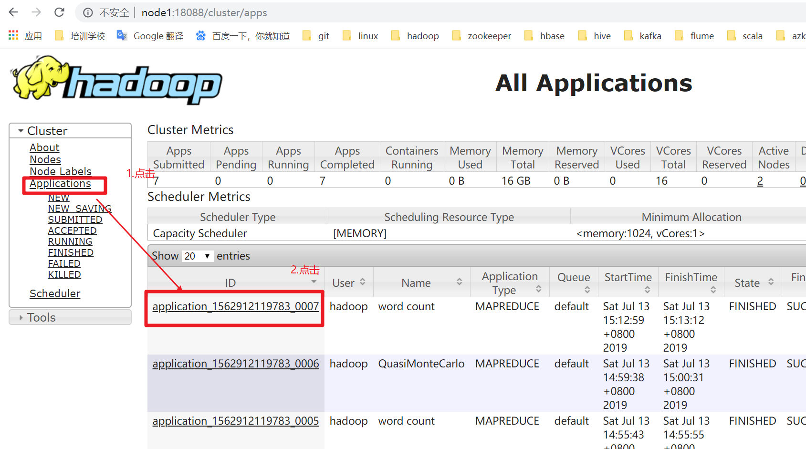
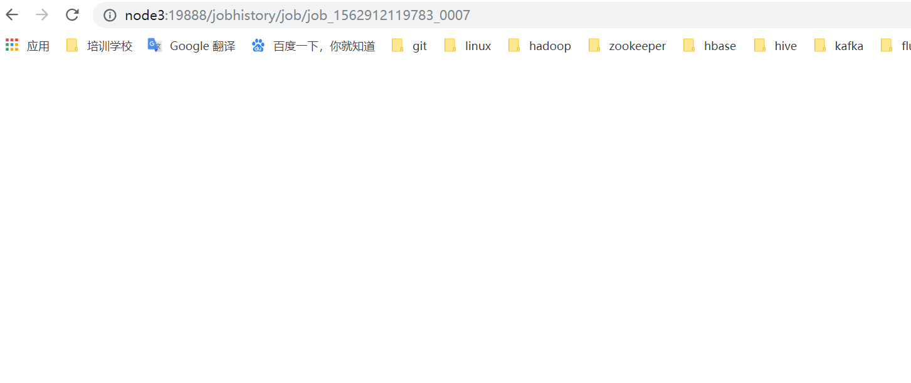
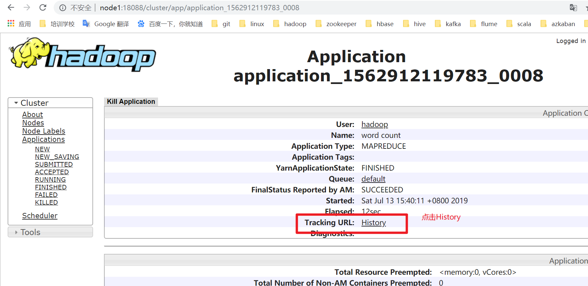
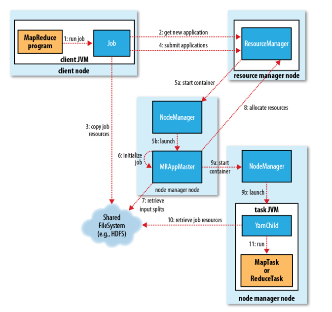

Yarn 资源调度系统

### 一. 课前准备

---

1. 搭建好三个节点的　hadoop 集群


### 二. 课堂主题

---

1. Yarn 架构
2. Yarn 应用提交过程
3. Yarn 的调度策略

### 三.  课堂目标

1. 了解 Yarn 资源和任务调度原理
2. 了解 如何使用Yarn 的可扩展性，效率和灵活性来增强集群性能

###　四. 知识要点

> 本堂使用　CDH 版本的 hadoop
>
> hadoop-2.6.0-cdh5.14.2

1. Yarn 介绍

   

   - Apache Hadoop YARN(Yet Another Resoure Negotiator) 是Hadoop 的子项目，为分离Hadoop 2.0资源管理和计算组件而引入

   - YARN 具有足够的通用性，可以支持其他的分布式计算模式

     

2. YARN 架构

   - 类似 HDFS ，YARN 也是经典的主从（master/slave）架构

     - YARN 服务由一个ResourceManager(RM) 和多个 NodeMarager（NM）构成

     - ResourceManager 为主节点（master）

     - NodeManager 为从节点（slave）

       

   - ApplicationMaster可以在容器内运行任何类型的任务。例如，MapReduce ApplicationMaster请求容器启动map或reduce任务，而Giraph ApplicationMaster请求容器运行Giraph任务。

   | 组件名                 | 作用                                                         |
   | :--------------------- | ------------------------------------------------------------ |
   | **ApplicationManager** | 相当于这个Application的监护人和管理者，负责监控、管理这个Application的所有Attempt在cluster中各个节点上的具体运行，同时负责向Yarn ResourceManager申请资源、返还资源等； |
   | **NodeManager**        | 是Slave上一个独立运行的进程，负责上报节点的状态(磁盘，内存，cpu等使用信息)； |
   | **Container**          | 是yarn中分配资源的一个单位，包涵内存、CPU等等资源，YARN以Container为单位分配资源； |

   ResourceManager 负责对各个 NodeManager 上资源进行统一管理和调度。当用户提交一个应用程序时，需要提供一个用以跟踪和管理这个程序的 ApplicationMaster ， 它负责向 ResourceMaster 申请资源，并要求 NodeManager 启动可以占用一定资源的任务。由于不同的 ApplicationMaster 被分布到不同的节点上，因此它们之间不会互相影响。

   Client向 ResourceManager提交的每一个应用程序都 必须有一个ApplicationMaster，它经过ResourceMaster分配资源后，运行于某一个Slave节点的Container 中，具体做事情的Task，两样也运行与某一个 Slave 节点的 Container中。

   2.1 **ResourceManager**

   - RM 是一个全局的资源管理器，集群只有一个
     - 负责整个系统的资源管理和分配
     - 包括处理客户端请求
     - 启动/监控 ApplicationMaster
     - 监控 NodeManager、资源的分配与调度
   - 它主要由两个组件构成：
     - 调度器（Scheduler）
     - 应用程序管理器（Application Manager, ASM）
   - 调度器
     - 它不从事任何与具体应用程序相关的工作，比如不负责监控或者跟踪应用的执行状态等，也不负责重新启动因应用执行失败或者硬件故障而产生的失败任务，这些均交由应用程序相关的ApplicationMast 完成。
     - 调度器仅根据各个应用程序的资源需求进行资源分配，而资源分配单位用一个抽象概念“资源容器”（Resources Container，简称 Container）表示，Container 是一个动态资源分配单位，它将内存、CPU、磁盘、网络等资源封装在一起，从而限定每个任务使用的资源量。
   - 应用程序管理器
     - 应用程序管理主要负责管理整个系统中所有应用程序
     - 接收 Job 的提交请求
     - 为应用分配第一个 Container 来运行 ApplicationMaster ， 包括应用程序提交、与调度器协商资源以启动ApplicationMaster、监控 ApplicationMaster 运行状态并在失败时重新启动它等

   2.2  **NodeManager**

   

   

   - NodeManager是一个Slave 服务，整个集群有多个
   - NodeManager：
     - 它负责接收 ResourceManager 的资源分配请求，分配具体的Container 给应用。
     - 负责监控并报告 Container 使用信息给 ResourceManager。
   - 功能：
     - NodeManager 本节点上的资源使用资源使用情况和各个 Container 的运行状态（CPU和内存等资源）
     - 接收及处理来自 ResourceManager 的命令请求，分配 Container 给应用的某个任务；
     - 定时地向RM汇报以确保整个集群平稳运行，RM通过收集每个 NodeManager 的报告信息来追踪整个集群健康状态的，而NodeManager负责监控自身的健康状态；
     - 处理来自 ApplicationMaster的请求
     - 管理着所在节点每个 Container 的生命周期；
     - 管理每个节点上的日志 ；
     - 当一个节点启动时，它会向 ResourceManager 进行注册并告知 ResourceManager 自己有多少资源可用；
     - 在运行期，通过 NodeManager 和 ResourceManager 协同工作，这些信息会不断被更新并保障整个集群发挥出最佳状态。
     - NodeManager 只负责管理自身 Container ，它并不知道运行在它上面应用的信息。负责管理应用信息的组件是 ApplicationMaster

   2.3  **Container**

   - Container 是 YARN 中的资源抽象
     - 它封装了某个节点上的多维度资源，如内存、CPU、磁盘、网络等
     - 当 AM 向 RM 申请资源时， RM 为 AM 返回的资源是用Container 表示的。
     - YARN会为每个任务分配一个 Container ，且该任务只能使用该 Container 中描述的资源 。
   - Container 和集群 NodeManager节点的关系是：
     - 一个NodeManager节点的关系是：
     - 但一个Container不会跨节点。
     - 任何一个 job 或 application 必须运行在一个或多个 Container中。
     - 在Yarn 框架中，ResourcesManager 只负责告诉 ApplicationMaster 哪些 Containers 可以用
     - ApplicationMaster还需要去找NodeManager 请求分配具体的Container。
   - 需要注意的是：
     - Container是一个动态资源划分单位，是根据应用程序 的需求动态生成的
     - 目前为止，YARN 支持 CPU和内存两种资源，且使用了轻量级资源隔离机制 Cgroups 进行资源隔离。
   - 功能 ：
     - 对task 环境的抽象；
     - 描述一系列信息；
     - 任务运行资源的集合（CPU、内存、IO等）；
     - 任务运行环境

   2.4  **ApplicationMaster**

   - 功能：
     - 数据切分；
     - 为应用程序申请资源并进一步分配给内部任务（TASK）
     - 任务监控与容错；
     - 负责协调来处 ResourcesManager 的资源，并通过NodeManager监视容器的执行和资源使用情况。
   - ApplicationMaster 与ResourcesManager 之间的通信
     - 是整个Yarn应用从提交到运行的最核心部分，是Yarn对整个集群进行动态资源管理的根本步骤
     - Yarn 的动态性，就是来源于多个 Application的ApplicationMaster动态地和Resourcesmanager 进行沟通，不断地申请，释放，再申请，现释放的过程 。

   2.5 **Resource Request**

   [引用连接](https://www.jianshu.com/p/f50e85bdb9ce)

   - Yarn的设计目标

     - 允许我们的各种应用以共享、安全，多租户的形式使用整个集群。
     - 并且，为了保证集群资源调度和数据访问的高效性，Yarn 还必须能够感知整个集群拓扑结构。

   - 为了实现这些目标，ResourceManager的调度器 Scheduler 为应用程序的资源请求定义了一些灵活的协议，Resource Request 和 Container。

     - 一个应用先向 ApplicationMaster 发送一个满足自己需求的资源请求
     - 然后 ApplicationMaster 把这个资源请求以 resource-request 的形式发送给 ResourceManager 的Scheduler
     - Scheduler 再在这个原始的 resource-request 中返回分配到的资源描述 Contaier。

   - 每个ResourceRequest 可看做一个可序列化 Java 对象，包含的字段信息如下 ：

     ```xml
     <!--
     - resource-name：资源名称，现阶段指的是资源所在的host和rack，后期可能还会支持虚拟机或者更复杂的网络结构
     - priority：资源的优先级
     - resource-requirement：资源的具体需求，现阶段指内存和cpu需求的数量
     - number-of-containers：满足需求的Container的集合
     -->
     <resource-name, priority, resource-requirement, number-of-containers>
     ```

   2.6  ** JobHistoryServe **

   - 作业历史服务

     - 记录在Yarn中调度的作业历史运行情况

     - 通过命令启动

       ```shell
       mr-jobhistory-daemon.sh start historyserver	
       ```

     - 在集群中的数据节点机器上单独使用命令启动直接启动即可。

     - 启动成功后会出现 JobHistoryServer 进程（使用 jps  命令查看，下面会有介绍）。

     - 并且可以从19888 端口进行查看日志详细信息

       ```shell
       node1:19888
       ```

       点击链接， 查看 job 日志

       

   - 如果没有启动 jobhistoryserver , 无法查看应用的日志

     

   - 点击 History 之后，跳转后的页面，如下图是空白的，因为没有启动 jobhistoryserver

     

     

   - jobhistoryserver 启动后，在此运行 MR 程序，如： wordcount

     

   - 点击History 链接，跳转一个新的页面

     - TaskType 中列举的 Map 和 reduce , Total 表示此次运行的 mapreduce 程序执行需要的 map 和 reduce 的任务数

       

   - 看到 Map 任务的相关信息比如，执行状态，启动时间，完成时间。

     

   - 可以使用同样的方式我们查看 reduce 任务执行的详细信息，这里不再赘述。

   - jobhistoryserver 就是进行作业运行过程中历史运行信息的记录，方便我们对作业进行分析

   2.7  **Timelines Server**

   - 用来写日志服务数据，一般来写与第三方结合的日志服务数据（比如 `spark`等）

   - 它是对jobhistoryserver 功能的有效补充，jobhistoryserver 只能对napreduce 类型的作业信息进行记录

   - 它记录除了 jobhistoryserver 能够进行对作业运行过程 中信息进行记录之外

   - 还记录更细粒度的信息，比如任务在哪个队列中运行，运行任务时设置的用户是哪个用户。

   - 根据官网的解释 `jobhistoryserver`只能记录mapreduce 应用程序的记录， timelinserver 功能更强大，但不是替代  jobhistory 两者是功能间的互补关系。

     

   - [官网教程](<http://hadoop.apache.org/docs/stable/hadoop-yarn/hadoop-yarn-site/TimelineServer.html>)

3. **YARN 应用运行原理**

   

   3.1 **YARN 应用提交过程**

   - Application在Yarn 中执行过程， 整个执行过程可以总结为三步：

     - 应用程序提交
     - 启动应用的ApplicationMaster 实例
     - ApplicationMaster 实例管理应用程序的执行

   - 具体提交过程为：

     

     - 客户端程序向 ResourceManager 提交应用，并请求一个 ApplicationMaster 实例；

     - ResourceManager 找到一个可以运行一个 Container 的 NodeManager ，并在这个 Container 中启动 ApplicationMaster 实例；

     - ApplicationMaster 向 ResourceManager 进行注册，注册之后客户端就可以查询 ResourceManager 获得自己 ApplicationMaster 的详细信息，以后就可以和自己的 ApplicationMaster 直接交互了（这个时候，客户端主动 和 ApplicationMaster交流，应用先向ApplicationMaster 发送一个满足自己需求的资源请求）；

     - ApplicationMaster 根据 resource-request 协议向 ResourceManager 发送 request 请求；

     - 当Container 被成功分配后，ApplicationMaster 通过向 NodeManager 发送 container-launch-specification 信息来启动 Container，container-launch-specification 信息包含了能够让 Container 和 Application交流所需要的资料；

     - 应用程序的代码以 task 形式在启动的 Container 中运行，并把运行的进度、状态等信息通过 application-specific 协议，发送给 Application；

     - 在应用程序运行期间，提交应用的应用客户端主动和 ApplicationMaster 向 ResourceManager 取消注册然后关闭，用到所有的 Container 也归还给系统 。

   - 精简版的：

     - 步骤1： 用户将用户程序提交到 ResourcesManager上；
     - 步骤2： ResourceManager 为应用程序 ApplicationMaster 申请资源，并与某个 NodeManager 通信启动第一个 Container ， 以启动 ApplicationMaster；
     - 步骤3 ： ApplicationMaster 与 ResourceManager 注册进行通信，为内部要执行的任务申请资源，一旦得到资源后，将于NodeManager 通信，以启动对应的 Task；
     - 步骤4： 所有任务运行完成后，ApplicationMaster 向 ResourceManager 注销，整个应用程序运行结束。

   3.2 MapReduce on  YARN

   

   - 提交作业

     - ①程序打成jar包，在客户端运行hadoop jar命令，提交job到集群运行
     - job.waitForCompletion(true)中调用Job的submit()，此方法中调用JobSubmitter的submitJobInternal()方法；
       - ②submitClient.getNewJobID()向resourcemanager请求一个MR作业id
       - 检查输出目录：如果没有指定输出目录或者目录已经存在，则报错
       - 计算作业分片；若无法计算分片，也会报错
       - ③运行作业的相关资源，如作业的jar包、配置文件、输入分片，被上传到HDFS上一个以作业ID命名的目录（jar包副本默认为10，运行作业的任务，如map任务、reduce任务时，可从这10个副本读取jar包）
       - ④调用resourcemanager的submitApplication()提交作业
     - 客户端**每秒**查询一下作业的进度（map 50% reduce 0%），进度如有变化，则在控制台打印进度报告；
     - 作业如果成功执行完成，则打印相关的计数器
     - 但如果失败，在控制台打印导致作业失败的原因（要学会查看日志，定位问题，分析问题，解决问题）

   - 初始化作业

     - 当ResourceManager(一下简称RM)收到了submitApplication()  方法的调用通知后，请求传递给RM的 scheduler (调度器)；调度器分配 container (容器)
     - ⑤a RM与指定的NodeManager通信，通知NodeManager启动容器；NodeManager收到通知后，创建占据特定资源的container；
     - ⑤b 然后在container中运行MRAppMaster进程
     - ⑥MRAppMaster需要接受任务（各map任务、reduce任务的）的进度、完成报告，所以appMaster需要创建多个簿记对象，记录这些信息
     - ⑦从HDFS获得client计算出的输入分片split
       - 每个分片split创建一个map任务
       - 通过 mapreduce.job.reduces 属性值(编程时，jog.setNumReduceTasks()指定)，知道当前MR要创建多少个reduce任务
       - 每个任务(map、reduce)有task id

   - Task 任务分配

     - 如果小作业，appMaster 会以  uberized 的方式运行MR 作业；appMaster 会决定在它的 JVM 中顺序此 MR的任务；

       - 原因是，若每个任务运行在一个单独的 JVM 时，都 需要单独启动VM ，分配资源（内存、CPU），需要时间；多个 JVM中的任务再在各自的J JVM 中并行运行

       - 若将所有任务在 appMaster 的 JVM 中顺序执行的话，更高效，那么 appMaster 就会这么做，任务作为 uber 任务运行

       - 小作业判断依据：

         ①小于10个map任务；

         ②只有一个reduce任务；

         ③MR输入大小小于一个HDFS块大小

       - 如何开启 uber ? 设置属性 mapreduce.job.ubertask.enable 值为 `true`

         ```shell
         configuration.set("mapreduce.job.ubertask.enable","true");
         ```

       - 在运行任何 task 之前， appMaster 调用 setupJob()  方法，创建 OutputCommitter , 创建作业的最终输出目录（一般为HDFS上的目录）及任务输出的临时目录（如map 任务的中间结果输出目录）

       - 

