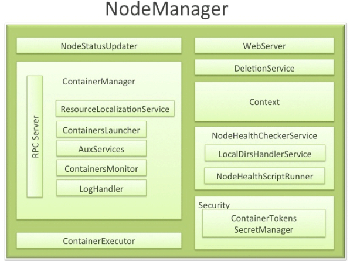

# YARN资源调度系统

# 一、课前准备

1. 搭建好三个节点的hadoop集群

# 二、课堂主题

1. YARN架构
2. YARN应用提交过程
3. YARN的调度策略

# 三、课堂目标

1. 了解YARN资源和任务调度原理
3. 了解如何使用YARN的可扩展性，效率和灵活性来增强集群性能

# 四、知识要点

> 本堂课使用CDH版本的hadoop
>
> hadoop-2.6.0-cdh5.14.2

## 1. YARN介绍（5分钟）


- Apache Hadoop YARN(Yet Another Resource Negotiator)是Hadoop的子项目，为分离Hadoop2.0资源管理和计算组件而引入
- YRAN具有足够的通用性，可以支持其它的分布式计算模式


## 2. YARN架构

- 类似HDFS，YARN也是经典的**主从（master/slave）架构**
  - YARN服务由一个ResourceManager（RM）和多个NodeManager（NM）构成
  - ResourceManager为主节点（master）
  - NodeManager为从节点（slave）


- ApplicationMaster可以在容器内运行任何类型的任务。例如，MapReduce ApplicationMaster请求容器启动map或reduce任务，而Giraph ApplicationMaster请求容器运行Giraph任务。

| 组件名                 | 作用                                                         |
| :--------------------- | ------------------------------------------------------------ |
| **ApplicationManager** | 相当于这个Application的监护人和管理者，负责监控、管理这个Application的所有Attempt在cluster中各个节点上的具体运行，同时负责向Yarn ResourceManager申请资源、返还资源等； |
| **NodeManager**        | 是Slave上一个独立运行的进程，负责上报节点的状态(磁盘，内存，cpu等使用信息)； |
| **Container**          | 是yarn中分配资源的一个单位，包涵内存、CPU等等资源，YARN以Container为单位分配资源； |

ResourceManager 负责对各个 NodeManager 上资源进行统一管理和调度。当用户提交一个应用程序时，需要提供一个用以跟踪和管理这个程序的 ApplicationMaster，它负责向 ResourceManager 申请资源，并要求 NodeManger 启动可以占用一定资源的任务。由于不同的 ApplicationMaster 被分布到不同的节点上，因此它们之间不会相互影响。

Client 向 ResourceManager 提交的每一个应用程序都必须有一个 ApplicationMaster，它经过 ResourceManager 分配资源后，运行于某一个 Slave 节点的 Container 中，具体做事情的 Task，同样也运行与某一个 Slave 节点的 Container 中。

### 2.1 **ResourceManager**

- RM是一个全局的资源管理器，集群只有一个
  - 负责整个系统的资源管理和分配
  - 包括处理客户端请求
  - 启动/监控 ApplicationMaster
  - 监控 NodeManager、资源的分配与调度
- 它主要由两个组件构成：
  - 调度器（Scheduler）
  - 应用程序管理器（Applications Manager，ASM）

- 调度器
  - 调度器根据容量、队列等限制条件（如每个队列分配一定的资源，最多执行一定数量的作业等），将系统中的资源分配给各个正在运行的应用程序。
  - 需要注意的是，该调度器是一个“纯调度器”
    - 它不从事任何与具体应用程序相关的工作，比如不负责监控或者跟踪应用的执行状态等，也不负责重新启动因应用执行失败或者硬件故障而产生的失败任务，这些均交由应用程序相关的ApplicationMaster完成。
    - 调度器仅根据各个应用程序的资源需求进行资源分配，而资源分配单位用一个抽象概念“资源容器”（Resource Container，简称Container）表示，Container是一个动态资源分配单位，它将内存、CPU、磁盘、网络等资源封装在一起，从而限定每个任务使用的资源量。

- 应用程序管理器
  - 应用程序管理器主要负责管理整个系统中所有应用程序
  - 接收job的提交请求
  - 为应用分配第一个 Container 来运行 ApplicationMaster，包括应用程序提交、与调度器协商资源以启动 ApplicationMaster、监控 ApplicationMaster 运行状态并在失败时重新启动它等

### 2.2 **NodeManager**



- NodeManager 是一个 slave 服务，整个集群有多个

- NodeManager ：
  - 它负责接收 ResourceManager 的资源分配请求，分配具体的 Container 给应用。
  - 负责监控并报告 Container 使用信息给 ResourceManager。

- 功能：

  - NodeManager 本节点上的资源使用情况和各个 Container 的运行状态（cpu和内存等资源）
  - 接收及处理来自 ResourceManager 的命令请求，分配 Container 给应用的某个任务；
  - 定时地向RM汇报以确保整个集群平稳运行，RM 通过收集每个 NodeManager 的报告信息来追踪整个集群健康状态的，而 NodeManager 负责监控自身的健康状态；
  - 处理来自 ApplicationMaster 的请求；
  - 管理着所在节点每个 Container 的生命周期；
  - 管理每个节点上的日志；

  - 当一个节点启动时，它会向 ResourceManager 进行注册并告知 ResourceManager 自己有多少资源可用。
  - 在运行期，通过 NodeManager 和 ResourceManager 协同工作，这些信息会不断被更新并保障整个集群发挥出最佳状态。

  - NodeManager 只负责管理自身的 Container，它并不知道运行在它上面应用的信息。负责管理应用信息的组件是 ApplicationMaster

### 2.3 Container

- Container 是 YARN 中的资源抽象
  - 它封装了某个节点上的多维度资源，如内存、CPU、磁盘、网络等
  - 当 AM 向 RM 申请资源时，RM 为 AM 返回的资源便是用 Container 表示的。
  - YARN 会为每个任务分配一个 Container，且该任务只能使用该 Container 中描述的资源。

- Container 和集群NodeManager节点的关系是：
  - 一个NodeManager节点可运行多个 Container
  - 但一个 Container 不会跨节点。
  - 任何一个 job 或 application 必须运行在一个或多个 Container 中
  - 在 Yarn 框架中，ResourceManager 只负责告诉 ApplicationMaster 哪些 Containers 可以用
  - ApplicationMaster 还需要去找 NodeManager 请求分配具体的 Container。

- 需要注意的是
  - Container 是一个动态资源划分单位，是根据应用程序的需求动态生成的
  - 目前为止，YARN 仅支持 CPU 和内存两种资源，且使用了轻量级资源隔离机制 Cgroups 进行资源隔离。

- 功能：
  - 对task环境的抽象；

  - 描述一系列信息；

  - 任务运行资源的集合（cpu、内存、io等）；

  - 任务运行环境

### 2.4 **ApplicationMaster**

- 功能：
  - 数据切分；
  - 为应用程序申请资源并进一步分配给内部任务（TASK）；
  - 任务监控与容错；
  - 负责协调来自ResourceManager的资源，并通过NodeManager监视容器的执行和资源使用情况。

- ApplicationMaster 与 ResourceManager 之间的通信
  - 是整个 Yarn 应用从提交到运行的最核心部分，是 Yarn 对整个集群进行动态资源管理的根本步骤
  - Yarn 的动态性，就是来源于多个Application 的 ApplicationMaster 动态地和 ResourceManager 进行沟通，不断地申请、释放、再申请、再释放资源的过程。

### 2.5 Resource Request

[引用连接](https://www.jianshu.com/p/f50e85bdb9ce)

- Yarn的设计目标
  - 允许我们的各种应用以共享、安全、多租户的形式使用整个集群。
  - 并且，为了保证集群资源调度和数据访问的高效性，Yarn还必须能够感知整个集群拓扑结构。

- 为了实现这些目标，ResourceManager的调度器Scheduler为应用程序的资源请求定义了一些灵活的协议，**Resource Request**和**Container**。
  - 一个应用先向ApplicationMaster发送一个满足自己需求的资源请求
  - 然后ApplicationMaster把这个资源请求以resource-request的形式发送给ResourceManager的Scheduler
  - Scheduler再在这个原始的resource-request中返回分配到的资源描述Container。

- 每个ResourceRequest可看做一个可序列化Java对象，包含的字段信息如下：

```xml
<!--
- resource-name：资源名称，现阶段指的是资源所在的host和rack，后期可能还会支持虚拟机或者更复杂的网络结构
- priority：资源的优先级
- resource-requirement：资源的具体需求，现阶段指内存和cpu需求的数量
- number-of-containers：满足需求的Container的集合
-->
<resource-name, priority, resource-requirement, number-of-containers>
```

### 2.6 JobHistoryServer 

- 作业历史服务

  - 记录在yarn中调度的作业历史运行情况情况 ,

  - 通过命令启动

    ```shell
  mr-jobhistory-daemon.sh start historyserver
    ```

  - 在集群中的数据节点机器上单独使用命令启动直接启动即可,
  
  - 启动成功后会出现JobHistoryServer进程(使用jps命令查看，下面会有介绍) ,
  
  - 并且可以从19888端口进行查看日志详细信息
  
    ```
    node01:19888
    ```
  
    点击链接，查看job日志
  
    
  
- 如果没有启动jobhistoryserver，无法查看应用的日志


- 打开如下图界面，在下图中点击History，页面会进行一次跳转


- 点击History之后 跳转后的页面如下图是空白的，因为没有启动jobhistoryserver


- jobhistoryserver启动后，在此运行MR程序，如wordcount


- 点击History连接，跳转一个赞新的页面
  - TaskType中列举的map和reduce，Total表示此次运行的mapreduce程序执行所需要的map和reduce的任务数


- 点击TaskType列中Map连接


- 看到map任务的相关信息比如执行状态,启动时间，完成时间。


- 可以使用同样的方式我们查看reduce任务执行的详细信息，这里不再赘述.

- jobhistoryserver就是进行作业运行过程中历史运行信息的记录，方便我们对作业进行分析.

### 2.7 Timeline Server 

- 用来写日志服务数据 , 一般来写与第三方结合的日志服务数据(比如spark等)
- 它是对jobhistoryserver功能的有效补充，jobhistoryserver只能对mapreduce类型的作业信息进行记录
- 它记录除了jobhistoryserver能够进行对作业运行过程中信息进行记录之外
- 还记录更细粒度的信息，比如任务在哪个队列中运行，运行任务时设置的用户是哪个用户。

- 根据官网的解释jobhistoryserver只能记录mapreduce应用程序的记录，timelineserver功能更强大,但不是替代jobhistory两者是功能间的互补关系.


- [官网教程](<http://hadoop.apache.org/docs/stable/hadoop-yarn/hadoop-yarn-site/TimelineServer.html>)


## 3. YARN应用运行原理


### 3.1 YARN应用提交过程

- Application在Yarn中的执行过程，整个执行过程可以总结为三步：
  - 应用程序提交
  - 启动应用的ApplicationMaster实例
  - ApplicationMaster 实例管理应用程序的执行

- **具体提交过程为：**

  

  - 客户端程序向 ResourceManager 提交应用，并请求一个 ApplicationMaster 实例；
  - ResourceManager 找到一个可以运行一个 Container 的 NodeManager，并在这个 Container 中启动 ApplicationMaster 实例；
  - ApplicationMaster 向 ResourceManager 进行注册，注册之后客户端就可以查询 ResourceManager 获得自己 ApplicationMaster 的详细信息，以后就可以和自己的 ApplicationMaster 直接交互了（这个时候，客户端主动和 ApplicationMaster 交流，应用先向 ApplicationMaster 发送一个满足自己需求的资源请求）；
  - ApplicationMaster 根据 resource-request协议 向 ResourceManager 发送 resource-request请求；
  - 当 Container 被成功分配后，ApplicationMaster 通过向 NodeManager 发送 **container-launch-specification**信息 来启动Container，container-launch-specification信息包含了能够让Container 和 ApplicationMaster 交流所需要的资料；
  - 应用程序的代码以 task 形式在启动的 Container 中运行，并把运行的进度、状态等信息通过 **application-specific**协议 发送给ApplicationMaster；
  - 在应用程序运行期间，提交应用的客户端主动和 ApplicationMaster 交流获得应用的运行状态、进度更新等信息，交流协议也是 **application-specific**协议；
  - 应用程序执行完成并且所有相关工作也已经完成，ApplicationMaster 向 ResourceManager 取消注册然后关闭，用到所有的 Container 也归还给系统。

- **精简版的：**
  - 步骤1：用户将应用程序提交到 ResourceManager 上；
  - 步骤2：ResourceManager为应用程序 ApplicationMaster 申请资源，并与某个 NodeManager 通信启动第一个 Container，以启动ApplicationMaster；
  - 步骤3：ApplicationMaster 与 ResourceManager 注册进行通信，为内部要执行的任务申请资源，一旦得到资源后，将于 NodeManager 通信，以启动对应的 Task；
  - 步骤4：所有任务运行完成后，ApplicationMaster 向 ResourceManager 注销，整个应用程序运行结束。

### 3.2 MapReduce on YARN


- 提交作业
  - ①程序打成jar包，在客户端运行hadoop jar命令，提交job到集群运行
  - job.waitForCompletion(true)中调用Job的submit()，此方法中调用JobSubmitter的submitJobInternal()方法；
    - ②submitClient.getNewJobID()向resourcemanager请求一个MR作业id
    - 检查输出目录：如果没有指定输出目录或者目录已经存在，则报错
    - 计算作业分片；若无法计算分片，也会报错
    - ③运行作业的相关资源，如作业的jar包、配置文件、输入分片，被上传到HDFS上一个以作业ID命名的目录（jar包副本默认为10，运行作业的任务，如map任务、reduce任务时，可从这10个副本读取jar包）
    - ④调用resourcemanager的submitApplication()提交作业
  - 客户端**每秒**查询一下作业的进度（map 50% reduce 0%），进度如有变化，则在控制台打印进度报告；
  - 作业如果成功执行完成，则打印相关的计数器
  - 但如果失败，在控制台打印导致作业失败的原因（要学会查看日志，定位问题，分析问题，解决问题）

- **初始化作业**

  - 当ResourceManager(一下简称RM)收到了submitApplication()方法的调用通知后，请求传递给RM的scheduler（调度器）；调度器分配container（容器）
  - ⑤a RM与指定的NodeManager通信，通知NodeManager启动容器；NodeManager收到通知后，创建占据特定资源的container；
  - ⑤b 然后在container中运行MRAppMaster进程
  - ⑥MRAppMaster需要接受任务（各map任务、reduce任务的）的进度、完成报告，所以appMaster需要创建多个簿记对象，记录这些信息
  - ⑦从HDFS获得client计算出的输入分片split
    - 每个分片split创建一个map任务
    - 通过 mapreduce.job.reduces 属性值(编程时，jog.setNumReduceTasks()指定)，知道当前MR要创建多少个reduce任务
    - 每个任务(map、reduce)有task id

- **Task 任务分配**

  - 如果小作业，appMaster会以uberized的方式运行此MR作业；appMaster会决定在它的JVM中顺序此MR的任务；

    - 原因是，若每个任务运行在一个单独的JVM时，都需要单独启动JVM，分配资源（内存、CPU），需要时间；多个JVM中的任务再在各自的JVM中并行运行

    - 若将所有任务在appMaster的JVM中顺序执行的话，更高效，那么appMaster就会这么做 ，任务作为uber任务运行

    - 小作业判断依据：①小于10个map任务；②只有一个reduce任务；③MR输入大小小于一个HDFS块大小

    - 如何开启uber?设置属性 mapreduce.job.ubertask.enable 值为true

      ```java
      configuration.set("mapreduce.job.ubertask.enable", "true");
      ```

    - 在运行任何task之前，appMaster调用setupJob()方法，创建OutputCommitter，创建作业的最终输出目录（一般为HDFS上的目录）及任务输出的临时目录（如map任务的中间结果输出目录）

  - ⑧若作业不以uber任务方式运行，那么appMaster会为作业中的每一个任务（map任务、reduce任务）向RM请求container

    - 由于reduce任务在进入排序阶段之前，所有的map任务必须执行完成；所以，为map任务申请容器要优先于为reduce任务申请容器
    - 5%的map任务执行完成后，才开始为reduce任务申请容器
    - 为map任务申请容器时，遵循数据本地化，调度器尽量将容器调度在map任务的输入分片所在的节点上（移动计算，不移动数据）

    - reduce任务能在集群任意计算节点运行
    - 默认情况下，为每个map任务、reduce任务分配1G内存、1个虚拟内核，由属性决定mapreduce.map.memory.mb、mapreduce.reduce.memory.mb、mapreduce.map.cpu.vcores、mapreduce.reduce.reduce.cpu.vcores

- **Task 任务执行**

  - 当调度器为当前任务分配了一个NodeManager（暂且称之为NM01）的容器，并将此信息传递给appMaster后；appMaster与NM01通信，告知NM01启动一个容器，并此容器占据特定的资源量（内存、CPU）
  - NM01收到消息后，启动容器，此容器占据指定的资源量
  - 容器中运行YarnChild，由YarnChild运行当前任务（map、reduce）
  - ⑩在容器中运行任务之前，先将运行任务需要的资源拉取到本地，如作业的JAR文件、配置文件、分布式缓存中的文件

- **作业运行进度与状态更新**

  - 作业job以及它的每个task都有状态（running、successfully completed、failed），当前任务的运行进度、作业计数器
  - 任务在运行期间，每隔3秒向appMaster汇报执行进度、状态（包括计数器）
  - appMaster汇总目前运行的所有任务的上报的结果
  - 客户端每个1秒，轮询访问appMaster获得作业执行的最新状态，若有改变，则在控制台打印出来

- 完成作业

  - appMaster收到最后一个任务完成的报告后，将作业状态设置为成功
  - 客户端轮询appMaster查询进度时，发现作业执行成功，程序从waitForCompletion()退出
  - 作业的所有统计信息打印在控制台
  - appMaster及运行任务的容器，清理中间的输出结果
  - 作业信息被历史服务器保存，留待以后用户查询

  


### 3.3 yarn应用生命周期

- RM: Resource Manager
- AM: Application Master
- NM: Node Manager

1. Client向RM提交应用，包括AM程序及启动AM的命令。
2. RM为AM分配第一个容器，并与对应的NM通信，令其在容器上启动应用的AM。
3. AM启动时向RM注册，允许Client向RM获取AM信息然后直接和AM通信。
4. AM通过资源请求协议，为应用协商容器资源。
5. 如容器分配成功，AM要求NM在容器中启动应用，应用启动后可以和AM独立通信。
6. 应用程序在容器中执行，并向AM汇报。
7. 在应用执行期间，Client和AM通信获取应用状态。
8. 应用执行完成，AM向RM注销并关闭，释放资源。

  **申请资源->启动appMaster->申请运行任务的container->分发Task->运行Task->Task结束->回收container**


## 4. 如何使用YARN

### 4.1 配置文件

```xml
<!-- $HADOOP_HOME/etc/hadoop/mapred-site.xml -->
<configuration>
    <property>
        <name>mapreduce.framework.name</name>
        <value>yarn</value>
    </property>
</configuration>
```

```xml
<!-- $HADOOP_HOME/etc/hadoop/yarn-site.xml -->
<configuration>
    <property>
        <name>yarn.nodemanager.aux-services</name>
        <value>mapreduce_shuffle</value>
    </property>
</configuration>
```

### 4.2 YARN启动停止

- 启动 ResourceManager 和 NodeManager （以下分别简称RM、NM）

```shell
#主节点运行命令
$HADOOP_HOME/sbin/start-yarn.sh
```

- 停止 RM 和 NM 

```shell
#主节点运行命令
$HADOOP_HOME/sbin/stop-yarn.sh
```

- 若RM没有启动起来，可以单独启动

```shell
#若RM没有启动，在主节点运行命令
$HADOOP_HOME/sbin/yarn-daemon.sh start resouremanager
#相反，可单独关闭
$HADOOP_HOME/sbin/yarn-daemon.sh stop resouremanager
```

- 若NM没有启动起来，可以单独启动

```shell
#若NM没有启动，在相应节点运行命令
$HADOOP_HOME/sbin/yarn-daemon.sh start nodemanager
#相反，可单独关闭
$HADOOP_HOME/sbin/yarn-daemon.sh stop nodemanager
```

### 4.3 YARN常用命令

**4.3.1 YARN命令列表**


**4.3.2 yarn application命令**


```shell
#1.查看正在运行的任务
yarn application -list
```

```shell
#2.杀掉正在运行任务
yarn application -kill 任务id
```

```shell
#3.查看节点列表
yarn node -list
```


```shell
#4.查看节点状况；所有端口号与上图中端口号要一致（随机分配）
yarn node -status node-03:45568
```


```shell
#5.查看yarn依赖jar的环境变量
yarn classpath
```


## 5. YARN调度器

- 试想一下，你现在所在的公司有**一个**hadoop的集群。但是A项目组经常做一些定时的BI报表，B项目组则经常使用一些软件做一些临时需求。那么他们肯定会遇到同时提交任务的场景，这个时候到底如何分配资源满足这两个任务呢？是先执行A的任务，再执行B的任务，还是同时跑两个？

- 在Yarn框架中，调度器是一块很重要的内容。有了合适的调度规则，就可以保证多个应用可以在同一时间有条不紊的工作。最原始的调度规则就是FIFO，即按照用户提交任务的时间来决定哪个任务先执行，先提交的先执行。但是这样很可能一个大任务独占资源，其他的资源需要不断的等待。也可能一堆小任务占用资源，大任务一直无法得到适当的资源，造成饥饿。所以FIFO虽然很简单，但是并不能满足我们的需求。

- 理想情况下，yarn应用发出的资源请求应该立刻给予满足。然而现实中的资源有限，在一个繁忙的集群上，一个应用经常需要等待才能得到所需的资源。yarn调度器的工作就是根据既定的策略为应用分配资源。调度通常是一个难题，并且**没有一个所谓的“最好”的策略**，这也是为什么yarn提供了多重调度器和可配置策略供我们选择的原因。

**yarn分为一级调度管理和二级调度管理**
一级调度管理(更近底层,更接近于操作资源, 更偏向于应用层和底层结合)
    计算资源管理(cpu,内存等,计算复杂消耗的cpu多)
    App生命周期管理
二级调度管理(自己代码的算法等, 更偏向于应用层)
    App内部的计算模型管理
    多样化的计算模型

### 5.1 调度器

- 在YARN中有三种调度器可以选择：FIFO Scheduler ，Capacity Scheduler，FairS cheduler


### 5.2 FIFO Scheduler

- FIFO Scheduler把应用按提交的顺序排成一个队列，这是一个先进先出队列，在进行资源分配的时候，先给队列中最头上的应用进行分配资源，待最头上的应用需求满足后再给下一个分配，以此类推。

- FIFO Scheduler是最简单也是最容易理解的调度器，也不需要任何配置，但它并不适用于共享集群。大的应用可能会占用所有集群资源，这就导致其它应用被阻塞。在共享集群中，更适合采用Capacity Scheduler或Fair Scheduler，这两个调度器都允许大任务和小任务在提交的同时获得一定的系统资源。

- 上图展示了这几个调度器的区别，从图中可以看出，在FIFO 调度器中，小任务会被大任务阻塞。

### 5.3 Capacity Scheduler

- CDH版本默认使用Fair Scheduler公平调度器


- 观察yarn web界面；使用的是fair scheduler


- 若要使用capacity scheduler，需要修改yarn-site.xml文件；node01上

  ```xml
  <property>
  	<name>yarn.resourcemanager.scheduler.class</name>
  	<value>org.apache.hadoop.yarn.server.resourcemanager.scheduler.capacity.CapacityScheduler</value>
  </property>
  ```

- 并分发到各节点

  ```shell
  [hadoop@node01 hadoop]$ pwd
  /kkb/install/hadoop-2.6.0-cdh5.14.2/etc/hadoop
  [hadoop@node01 hadoop]$ scp yarn-site.xml node02:$PWD
  [hadoop@node01 hadoop]$ scp yarn-site.xml node03:$PWD
  ```

- 重启yarn

  ```shell
  [hadoop@node01 hadoop]$ stop-yarn.sh
  [hadoop@node01 hadoop]$ start-yarn.sh
  ```

- 而对于Capacity调度器，有一个专门的队列用来运行小任务，但是为小任务专门设置一个队列会预先占用一定的集群资源，这就导致大任务的执行时间会落后于使用FIFO调度器时的时间

- 如何配置容量调度器

  - 队列层级结构如下

    ```
    root 
    ├── prod 
    └── dev 
    	├── spark 
    	└── hdp
    ```

  - 主节点上，将$HADOOP_HOME/etc/hadoop/中的对应capacity-scheduler.xml配置文件备份到其它目录
  
  - 目录$HADOOP_HOME/etc/hadoop/中建立一个新的capacity-scheduler.xml；内容如下
  
    ```xml
    <?xml version="1.0" encoding="utf-8"?>
    
    <configuration> 
      <property> 
        <name>yarn.scheduler.capacity.root.queues</name>  
        <value>prod,dev</value> 
      </property>  
      <property> 
        <name>yarn.scheduler.capacity.root.dev.queues</name>  
        <value>hdp,spark</value> 
      </property>  
      <property> 
        <name>yarn.scheduler.capacity.root.prod.capacity</name>  
        <value>40</value> 
      </property>  
      <property> 
        <name>yarn.scheduler.capacity.root.dev.capacity</name>  
        <value>60</value> 
      </property>  
      <property> 
        <name>yarn.scheduler.capacity.root.dev.maximum-capacity</name>  
        <value>75</value> 
      </property>  
      <property> 
        <name>yarn.scheduler.capacity.root.dev.hdp.capacity</name>  
        <value>50</value> 
      </property>  
      <property> 
        <name>yarn.scheduler.capacity.root.dev.spark.capacity</name>  
        <value>50</value> 
      </property> 
    </configuration>
    ```
  
  - 将此xml文件，远程拷贝到相同目录下
  
  - 将应用放置在哪个队列中，取决于应用本身。
  
    例如MR，可以通过设置属性**mapreduce.job.queuename**指定相应队列。以WordCount为例，如下
  
    如果指定的队列不存在，则发生错误。如果不指定，默认使用"default"队列，如下图


- 动态更新配置：容量调度器的配置在运行时，可以随时重新加载，调整资源分配参数；你需要编辑conf/capacity-scheduler.xml 并在yarn主节点运行命令让配置文件生效
  - 另外，除非重启resourcemanager，否则队列只能添加不能删除；但允许关闭

```shell
[hadoop@node01 hadoop]$ yarn rmadmin -refreshQueues
```

- 程序打包，提交集群运行

```shell
[hadoop@node01 target]$ hadoop jar com.kaikeba.hadoop-1.0-SNAPSHOT.jar com.kaikeba.hadoop.wordcount.WordCountMain /README.txt /w24
```


### 5.4 Fair Scheduler

.png)

- Apache Hadoop默认使用Capacity Scheduler容量调度器

- CDH版本默认使用Fair Scheduler公平调度器


- 若要用Fair Scheduler的话，需要配置yarn-site.xml，将属性"yarn.resourcemanager.scheduler.class"的值修改成"org.apache.hadoop.yarn.server.resourcemanager.scheduler.fair.FairScheduler"，如下

```xml
<property>
	<name>yarn.resourcemanager.scheduler.class</name>
	<value>org.apache.hadoop.yarn.server.resourcemanager.scheduler.fair.FairScheduler</value>
</property>
```


- 注意：同样，集群中所有yarn-site.xml文件要同步更新

- 在Fair调度器中，我们不需要预先占用一定的系统资源，Fair调度器会为所有运行的job动态的调整系统资源。如下图所示，当第一个大job提交时，只有这一个job在运行，此时它获得了所有集群资源；当第二个小任务提交后，Fair调度器会分配一半资源给这个小任务，让这两个任务公平的共享集群资源。

- 需要注意的是，在下图Fair调度器中，从第二个任务提交到获得资源会有一定的延迟，因为它需要等待第一个任务释放占用的Container。小任务执行完成之后也会释放自己占用的资源，大任务又获得了全部的系统资源。最终的效果就是Fair调度器即得到了高的资源利用率又能保证小任务及时完成.

- 支持资源抢占

在yarn-site.xml中设置yarn.scheduler.fair.preemption为true

- 可通过一个名为fair-scheduler.xml文件对公平调度器进行配置
- 此文件可放置在${HADOOP_HOME}/etc/hadoop/目录下
- 当没有设置此配置文件时，每个应用放置在以当前用户名命名的队列中
- 队列是用户提交第一个应用时动态创建的


## 6. YARN应用状态

我们在yarn 的web ui上能够看到yarn 应用程序分为如下几个状态:

- NEW -----新建状态
- NEW_SAVING-----新建保存状态
- SUBMITTED-----提交状态
- ACCEPTED-----接受状态
- RUNNING-----运行状态
- FINISHED-----完成状态
- FAILED-----失败状态
- KILLED-----杀掉状态


# 五、拓展点、未来计划、行业趋势（5分钟）

1. [查看官网capacity scheduler内容](<https://hadoop.apache.org/docs/r2.7.3/hadoop-yarn/hadoop-yarn-site/CapacityScheduler.html>)
2. [capacity scheduler参考资料](<https://blog.csdn.net/u014589856/article/details/78119504>)
3. [官网查看fair scheduler内容](<https://hadoop.apache.org/docs/r2.7.3/hadoop-yarn/hadoop-yarn-site/FairScheduler.html>)
4. 《Hadoop权威指南 第4版》
   - 4.3 YARN中的调度
   - 7.1 剖析MapReduce运行机制


# 六、总结（5分钟）


1. 介绍了yarn的应用场景
2. yarn的核心组件
3. yarn应用调度过程
4. yarn的典型应用

# 七、作业


# 八、互动问答


# 九、题库 - 本堂课知识点

  