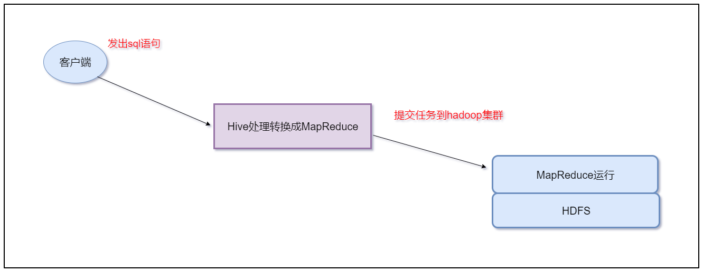
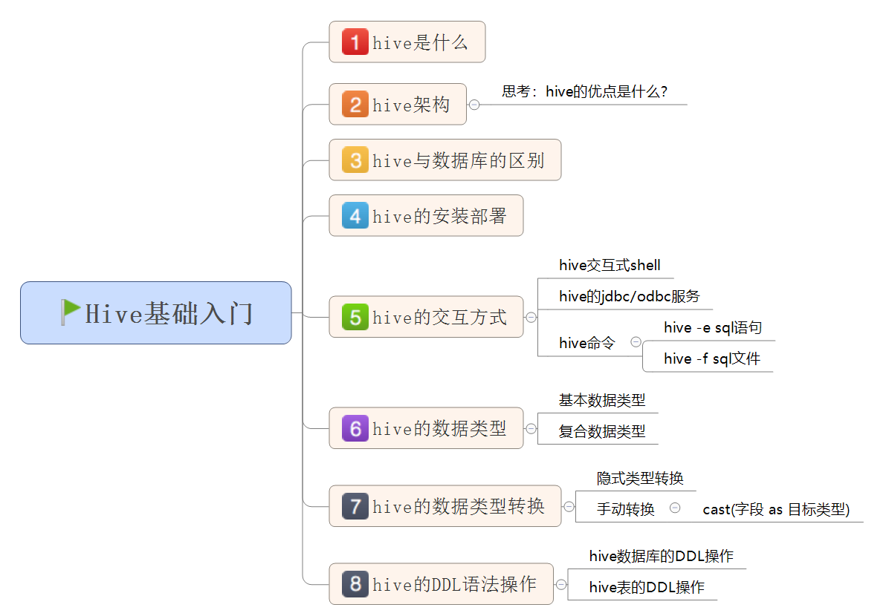

# 大数据分析利器之hive


## 一、课前准备

1. 安装好对应版本的hadoop集群，并启动hadoop的hdfs以及yarn服务

2. 安装mysql服务，并启动mysql的服务

## 二、课堂主题

本堂课主要围绕hive的基础知识点进行讲解。主要包括以下几个方面

1. hive的核心概念
2. hive与数据库的区别
3. hive的架构原理
4. hive的安装部署
5. hive的交互式方式
6. hive的数据类型
7. hive的DDL语法操作


## 三、课堂目标

1. 理解hive的核心概念和架构原理
2. 掌握hive的优缺点
3. 掌握hive的安装部署
4. 掌握hive的交互式方式使用
5. 掌握hive的数据类型
6. 掌握hive的DDL语法操作


## 四、知识要点

### 1.数据仓库的基本概念

#### 1.数据仓库的基本概念

英文名称为Data Warehouse，可简写为DW或DWH。数据仓库的目的是构建面向分析的集成化数据环境，为企业提供决策支持（Decision Support）。它出于分析性报告和决策支持目的而创建。

数据仓库本身并不“生产”任何数据，同时自身也不需要“消费”任何的数据，数据来源于外部，并且开放给外部应用，这也是为什么叫“仓库”，而不叫“工厂”的原因。

#### 2.数据仓库的主要特征

数据仓库是面向主题的（Subject-Oriented）、集成的（Integrated）、非易失的（Non-Volatile）和时变的（Time-Variant ）数据集合，用以支持管理决策。

#### 3. 数据仓库与数据库区别 

数据库与数据仓库的区别实际讲的是 OLTP 与 OLAP 的区别。 

操作型处理，叫联机事务处理 OLTP（On-Line Transaction Processing，），也可以称面向交易的处理系统，它是针对具体业务在数据库联机的日常操作，通常对少数记录进行查询、修改。用户较为关心操作的响应时间、数据的安全性、完整性和并发支持的用户数等问题。传统的数据库系统作为数据管理的主要手段，主要用于操作型处理。 

分析型处理，叫联机分析处理 OLAP（On-Line Analytical Processing）一般针对某些主题的历史数据进行分析，支持管理决策。

首先要明白，数据仓库的出现，并不是要取代数据库。

数据库是面向事务的设计，数据仓库是面向主题设计的。

数据库一般存储业务数据，数据仓库存储的一般是历史数据。

数据库设计是尽量避免冗余，一般针对某一业务应用进行设计，比如一张简单的User表，记录用户名、密码等简单数据即可，符合业务应用，但是不符合分析。数据仓库在设计是有意引入冗余，依照分析需求，分析维度、分析指标进行设计。

数据库是为捕获数据而设计，数据仓库是为分析数据而设计。

以银行业务为例。数据库是事务系统的数据平台，客户在银行做的每笔交易都会写入数据库，被记录下来，这里，可以简单地理解为用数据库记账。数据仓库是分析系统的数据平台，它从事务系统获取数据，并做汇总、加工，为决策者提供决策的依据。比如，某银行某分行一个月发生多少交易，该分行当前存款余额是多少。如果存款又多，消费交易又多，那么该地区就有必要设立ATM了。 

显然，银行的交易量是巨大的，通常以百万甚至千万次来计算。事务系统是实时的，这就要求时效性，客户存一笔钱需要几十秒是无法忍受的，这就要求数据库只能存储很短一段时间的数据。而分析系统是事后的，它要提供关注时间段内所有的有效数据。这些数据是海量的，汇总计算起来也要慢一些，但是，只要能够提供有效的分析数据就达到目的了。 

数据仓库，是在数据库已经大量存在的情况下，为了进一步挖掘数据资源、为了决策需要而产生的，它决不是所谓的“大型数据库”。

#### 4.数据仓库分层架构

按照数据流入流出的过程，数据仓库架构可分为三层——**源数据**、**数据仓库**、**数据应用。**                            

数据仓库的数据来源于不同的源数据，并提供多样的数据应用，数据自下而上流入数据仓库后向上层开放应用，而数据仓库只是中间集成化数据管理的一个平台。

源数据层（ODS）：此层数据无任何更改，直接沿用外围系统数据结构和数据，不对外开放；为临时存储层，是接口数据的临时存储区域，为后一步的数据处理做准备。

数据仓库层（DW）：也称为细节层，DW层的数据应该是一致的、准确的、干净的数据，即对源系统数据进行了清洗（去除了杂质）后的数据。

数据应用层（DA或APP）：前端应用直接读取的数据源；根据报表、专题分析需求而计算生成的数据。

数据仓库从各数据源获取数据及在数据仓库内的数据转换和流动都可以认为是ETL（抽取Extra, 转化Transfer, 装载Load）的过程，ETL是数据仓库的流水线，也可以认为是数据仓库的血液，它维系着数据仓库中数据的新陈代谢，而数据仓库日常的管理和维护工作的大部分精力就是保持ETL的正常和稳定。

为什么要对数据仓库分层？

用空间换时间，通过大量的预处理来提升应用系统的用户体验（效率），因此数据仓库会存在大量冗余的数据；不分层的话，如果源业务系统的业务规则发生变化将会影响整个数据清洗过程，工作量巨大。

通过数据分层管理可以简化数据清洗的过程，因为把原来一步的工作分到了多个步骤去完成，相当于把一个复杂的工作拆成了多个简单的工作，把一个大的黑盒变成了一个白盒，每一层的处理逻辑都相对简单和容易理解，这样我们比较容易保证每一个步骤的正确性，当数据发生错误的时候，往往我们只需要局部调整某个步骤即可。

### 2. Hive是什么

#### 1 hive的概念

Hive是基于Hadoop的一个数据仓库工具，==可以将结构化的数据文件映射为一张数据库表==，并提供类SQL查询功能。其本质是将SQL转换为MapReduce的任务进行运算，底层由HDFS来提供数据的存储，说白了hive可以理解为一个将SQL转换为MapReduce的任务的工具，甚至更进一步可以说hive就是一个MapReduce的客户端




#### 2 Hive与数据库的区别


* Hive 具有 SQL 数据库的外表，但应用场景完全不同。
* ==Hive 只适合用来做海量离线数据统计分析，也就是数据仓库==。


#### 3 Hive的优缺点


* ==优点==
  * **操作接口采用类SQL语法**，提供快速开发的能力（简单、容易上手）。

  * **避免了去写MapReduce**，减少开发人员的学习成本。

  * **Hive支持用户自定义函数**，用户可以根据自己的需求来实现自己的函数。

* ==缺点==
  * **Hive 不支持记录级别的增删改操作**
  * **Hive 的查询延迟很严重**
    * hadoop jar  xxxx.jar  xxx.class /input /output
      * 进行任务的划分，然后进行计算资源的申请
      * map 0%  reduce 0%
      * map 10%  reduce 0%
  * **Hive 不支持事务**


#### 4 Hive架构原理


* 1、用户接口：Client
- CLI（hive shell）、JDBC/ODBC(java访问hive)、WEBUI（浏览器访问hive）
  
* 2、元数据：Metastore
  * 元数据包括：表名、表所属的数据库（默认是default）、表的拥有者、列/分区字段、表的类型（是否是外部表）、表的数据所在目录等；

    * 默认存储在自带的derby数据库中，==推荐使用MySQL存储Metastore==

* 3、Hadoop集群
  * 使用HDFS进行存储，使用MapReduce进行计算。

* 4、Driver：驱动器
  * 解析器（SQL Parser） 
    * 将SQL字符串转换成抽象语法树AST
    * 对AST进行语法分析，比如表是否存在、字段是否存在、SQL语义是否有误
  * 编译器（Physical Plan）：将AST编译生成逻辑执行计划
  * 优化器（Query Optimizer）：对逻辑执行计划进行优化
  * 执行器（Execution）：把逻辑执行计划转换成可以运行的物理计划。对于Hive来说默认就是mapreduce任务


### 3. Hive的安装部署

​	注意hive就是==一个构建数据仓库的工具==，只需要在==一台服务器上==安装就可以了，不需要在多台服务器上安装。 

* 1、提前先安装好mysql服务和hadoop集群

  * 详细见<https://www.cnblogs.com/brianzhu/p/8575243.html>

* 2、下载hive的安装包

  * http://archive.cloudera.com/cdh5/cdh/5/hive-1.1.0-cdh5.14.2.tar.gz
  
* 3、规划安装目录

  * /kkb/install

* 4、上传安装包到node03服务器中的/kkb/soft路径下

* 5、解压安装包到指定的规划目录

  * ```
    cd /kkb/soft/
    tar -zxf hive-1.1.0-cdh5.14.2.tar.gz -C /kkb/install/
    ```

    

* 6、修改配置文件

  * 进入到Hive的安装目录下的conf文件夹中

    * cd /kkb/install/hive-1.1.0-cdh5.14.2/conf/

    * mv  hive-env.sh.template hive-env.sh
    
    * vim hive-env.sh
    
      ~~~shell
      #配置HADOOP_HOME路径
  export HADOOP_HOME=/kkb/install/hadoop-2.6.0-cdh5.14.2/
      #配置HIVE_CONF_DIR路径
  export HIVE_CONF_DIR=/kkb/install/hive-1.1.0-cdh5.14.2/conf
      ~~~
    
    * vim hive-site.xml
    
      ~~~xml
      <?xml-stylesheet type="text/xsl" href="configuration.xsl"?>
      <configuration>
              <property>
                      <name>javax.jdo.option.ConnectionURL</name>
                      <value>jdbc:mysql://node03:3306/hive?createDatabaseIfNotExist=true&amp;characterEncoding=latin1&amp;useSSL=false</value>
              </property>
      
              <property>
                      <name>javax.jdo.option.ConnectionDriverName</name>
                      <value>com.mysql.jdbc.Driver</value>
              </property>
              <property>
                      <name>javax.jdo.option.ConnectionUserName</name>
                      <value>root</value>
              </property>
              <property>
                      <name>javax.jdo.option.ConnectionPassword</name>
                      <value>123456</value>
              </property>
              <property>
                      <name>hive.cli.print.current.db</name>
                      <value>true</value>
              </property>
              <property>
                      <name>hive.cli.print.header</name>
                  <value>true</value>
              </property>
          <property>
                      <name>hive.server2.thrift.bind.host</name>
                      <value>node03.kaikeba.com</value>
              </property>
      </configuration>
      
      ~~~
    
    * 修改hive的日志配置文件路径，便于我们排查hive出现的错误问题
    
      ​	node03执行以下命令，定义hive的日志文件存放路径
      
      ​	
      
      ```
      mkdir -p /kkb/install/hive-1.1.0-cdh5.14.2/logs/
      cd /kkb/install/hive-1.1.0-cdh5.14.2/conf/
      mv hive-log4j.properties.template hive-log4j.properties
      vim hive-log4j.properties
      
      #更改以下内容，设置我们的日志文件存放的路径
      hive.log.dir=/kkb/install/hive-1.1.0-cdh5.14.2/logs/
      
      ```
      
      
      
    * ps: ==需要将mysql的驱动包上传到hive的lib目录下==
    
      * 例如 mysql-connector-java-5.1.38.jar


### 4. hive的交互方式 

* ==先启动hadoop集群和mysql服务==

#### 1 Hive交互shell

~~~shell
cd /kkb/install/hive-1.1.0-cdh5.14.2
bin/hive
~~~

#### 2 Hive JDBC服务

* 启动hiveserver2服务

  * 前台启动

    ~~~shell
    cd /kkb/install/hive-1.1.0-cdh5.14.2
    bin/hive --service hiveserver2
    ~~~
    
  * 后台启动
  ~~~shell
  cd /kkb/install/hive-1.1.0-cdh5.14.2
  nohup  bin/hive --service hiveserver2  &
  ~~~
  
* beeline连接hiveserver2

  重新开启一个会话窗口，然后使用beeline连接hive
  
  ~~~shell
  cd /kkb/install/hive-1.1.0-cdh5.14.2
  bin/beeline
beeline> !connect jdbc:hive2://node03:10000
  ~~~
  


#### 3  Hive的命令

* hive  ==-e== sql语句
  * 使用 –e  参数来直接执行hql的语句

~~~
cd /kkb/install/hive-1.1.0-cdh5.14.2/
bin/hive -e "show databases"
~~~

* hive  ==-f==  sql文件
  
  * 使用 –f  参数执行包含hql语句的文件
  
  * node03执行以下命令准备hive执行脚本
  
  * ```
    cd /kkb/install/
    vim hive.sql
    
    文件内容如下
    create database if not exists myhive;
    
    通过以下命令来执行我们的hive脚本
    cd /kkb/install/hive-1.1.0-cdh5.14.2/
    bin/hive -f /kkb/install/hive.sql 
    ```

### 5、Hive的数据类型

#### 1 基本数据类型


|    类型名称    |              描述               |    举例    |
| :------------: | :-----------------------------: | :--------: |
|    boolean     |           true/false            |    true    |
|    tinyint     |        1字节的有符号整数        |     1      |
|    smallint    |        2字节的有符号整数        |     1      |
|  ==**int**==   |        4字节的有符号整数        |     1      |
| **==bigint==** |        8字节的有符号整数        |     1      |
|     float      |        4字节单精度浮点数        |    1.0     |
| **==double==** |        8字节单精度浮点数        |    1.0     |
| **==string==** |        字符串(不设长度)         |   “abc”    |
|    varchar     | 字符串（1-65355长度，超长截断） |   “abc”    |
|   timestamp    |             时间戳              | 1563157873 |
|      date      |              日期               |  20190715  |


#### 2 复合数据类型

| 类型名称 |                         描述                          |       举例        |
| :------: | :---------------------------------------------------: | :---------------: |
|  array   | 一组有序的字段，字段类型必须相同 array(元素1，元素2)  |  Array（1,2,3）   |
|   map    |           一组无序的键值对 map(k1,v1,k2,v2)           | Map(‘a’,1,'b',2)  |
|  struct  | 一组命名的字段，字段类型可以不同 struct(元素1，元素2) | Struct('a',1,2,0) |

* array字段的元素访问方式：

  * 下标获取元素，下标从0开始

    * 获取第一个元素

      * array[0]

* map字段的元素访问方式

  * 通过键获取值

    * 获取a这个key对应的value

      * map['a']


* struct字段的元素获取方式
  * 定义一个字段c的类型为struct{a int;b string}
    * 获取a和b的值
      * 使用c.a 和c.b 获取其中的元素值
        * 这里可以把这种类型看成是一个对象

~~~sql
create table complex(
         col1 array<int>,
         col2 map<string,int>,
         col3 struct<a:string,b:int,c:double>
)

~~~


### 6、Hive的DDL操作

#### 1 hive的数据库DDL操作

##### 1、创建数据库

```sql
hive > create database db_hive;
# 或者
hive > create database if not exists db_hive;
```

- 数据库在HDFS上的默认存储路径是==/user/hive/warehouse/*.db==


##### 2、显示所有数据库

```sql
  hive> show databases;
```

##### 3、查询数据库	

```sql
hive> show databases like 'db_hive*';
```

##### 4、查看数据库详情

```sql
hive> desc database db_hive;
```

##### 5、显示数据库详细信息

```sql
hive> desc database extended db_hive;
```

##### 6、切换当前数据库

```sql
hive > use db_hive;
```

##### 7、删除数据库

```sql
#删除为空的数据库
hive> drop database db_hive;

#如果删除的数据库不存在，最好采用if exists 判断数据库是否存在
hive> drop database if exists db_hive;

#如果数据库中有表存在，这里需要使用cascade强制删除数据库
hive> drop database if exists db_hive cascade;
```

#### 2 hive的表DDL操作

##### 1 、建表语法介绍

```sql
CREATE [EXTERNAL] TABLE [IF NOT EXISTS] table_name 
[(col_name data_type [COMMENT col_comment], ...)] 
[COMMENT table_comment] 
[PARTITIONED BY (col_name data_type [COMMENT col_comment], ...)] 分区
[CLUSTERED BY (col_name, col_name, ...) 分桶
[SORTED BY (col_name [ASC|DESC], ...)] INTO num_buckets BUCKETS] 
[ROW FORMAT row_format]  row format delimited fields terminated by “分隔符”
[STORED AS file_format] 
[LOCATION hdfs_path]
```

官网地址：<https://cwiki.apache.org/confluence/display/Hive/LanguageManual+DDL>

##### 2 、字段解释说明

- create table 

  - 创建一个指定名字的表
- EXTERNAL  

  - 创建一个外部表，在建表的同时指定一个指向实际数据的路径（LOCATION），指定表的数据保存在哪里
- COMMENT

  - 为表和列添加注释
- PARTITIONED BY

  - 创建分区表
- CLUSTERED BY

  - 创建分桶表
- SORTED BY

  - 按照字段排序（一般不常用）
- ROW FORMAT
  - 指定每一行中字段的分隔符

    - row format delimited fields terminated by ‘\t’

* STORED AS
  * 指定存储文件类型
    - 常用的存储文件类型：SEQUENCEFILE（二进制序列文件）、TEXTFILE（文本）、RCFILE（列式存储格式文件）
    - 如果文件数据是纯文本，可以使用STORED AS TEXTFILE。如果数据需要压缩，使用 STORED AS SEQUENCEFILE

- LOCATION 

  - 指定表在HDFS上的存储位置。

##### 3、 创建内部表

- 1、==直接建表==
  - 使用标准的建表语句

```sql
use myhive;
create table stu(id int,name string);

可以通过insert  into  向hive表当中插入数据，但是不建议工作当中这么做
insert  into stu(id,name) values(1,"zhangsan");
select * from  stu;
```

- 2、==查询建表法==
  - 通过AS 查询语句完成建表：将子查询的结果存在新表里，有数据 

```sql
create table if not exists myhive.stu1 as select id, name from stu;
```

- 3、==like建表法==
  - 根据已经存在的表结构创建表

```sql
create table if not exists myhive.stu2 like stu;
```

- 4、查询表的类型

```sql
hive > desc formatted myhive.stu;
```


创建内部表并指定字段之间的分隔符，指定文件的存储格式，以及数据存放的位置

```
create  table if not exists myhive.stu3(id int ,name string)
row format delimited fields terminated by '\t' stored as textfile location       '/user/stu2';
```

##### 4、 创建外部表

外部表因为是指定其他的hdfs路径的数据加载到表当中来，所以hive表会认为自己不完全独占这份数据，所以删除hive表的时候，数据仍然存放在hdfs当中，不会删掉

```
create external table myhive.teacher (t_id string,t_name string) row format delimited fields terminated by '\t';
```

- 创建外部表的时候需要加上**==external==** 关键字
- location字段可以指定，也可以不指定
  - 指定就是数据存放的具体目录
  - 不指定就是使用默认目录 ==/user/hive/warehouse==


向外部表当中加载数据：

我们前面已经看到过通过insert的方式向内部表当中插入数据，外部表也可以通过insert的方式进行插入数据，只不过insert的方式，我们一般都不推荐，实际工作当中我们都是使用load的方式来加载数据到内部表或者外部表

load数据可以从本地文件系统加载或者也可以从hdfs上面的数据进行加载

- 从本地文件系统加载数据到teacher表当中去，==将我们附件当汇总的数据资料都上传到node03服务器的/kkb/install/hivedatas路径下面去==

  ```
  mkdir -p /kkb/install/hivedatas
  #将数据都上传到/kkb/install/hivedatas路径下，然后在hive客户端下执行以下操作
  load data local inpath '/kkb/install/hivedatas/teacher.csv' into table myhive.teacher;
  ```

- 从hdfs上面加载文件到teacher表里面去(将teacher.csv文件上传到==hdfs的/kkb/hdfsload/hivedatas==路径下)

  ```shell
  cd /kkb/install/hivedatas
  hdfs dfs -mkdir -p /kkb/hdfsload/hivedatas
  hdfs dfs -put teacher.csv /kkb/hdfsload/hivedatas
  # 在hive的客户端当中执行
  load  data  inpath  '/kkb/hdfsload/hivedatas'  overwrite into table myhive.teacher;
  ```

##### 5、 内部表与外部表的互相转换

- 1、内部表转换为外部表

```sql
#将stu内部表改为外部表
alter table stu set tblproperties('EXTERNAL'='TRUE');
```

- 2、外部表转换为内部表

```sql
#把emp外部表改为内部表
alter table teacher set tblproperties('EXTERNAL'='FALSE');
```

##### 6、 内部表与外部表的区别

- 1、建表语法的区别
  - 外部表在创建的时候需要加上==external==关键字

- 2、删除表之后的区别
  - 内部表删除后，表的元数据和真实数据都被删除了
- 外部表删除后，仅仅只是把该表的元数据删除了，真实数据还在，后期还是可以恢复出来

##### 7、内部表与外部表的使用时机

​	内部表由于删除表的时候会同步删除HDFS的数据文件，所以确定如果一个表仅仅是你独占使用，其他人不适用的时候就可以创建内部表，如果一个表的文件数据，其他人也要使用，那么就创建外部表

一般外部表都是用在数据仓库的ODS层

内部表都是用在数据仓库的DW层

##### 8、hive的分区表

如果hive当中所有的数据都存入到一个文件夹下面，那么在使用MR计算程序的时候，读取一整个目录下面的所有文件来进行计算，就会变得特别慢，因为数据量太大了，实际工作当中一般都是计算前一天的数据，所以我们只需要将前一天的数据挑出来放到一个文件夹下面即可，专门去计算前一天的数据。这样就可以使用hive当中的分区表，通过分文件夹的形式，将每一天的数据都分成为一个文件夹，然后我们计算数据的时候，通过指定前一天的文件夹即可只计算前一天的数据。

在大数据中，最常用的一种思想就是分治，我们可以把大的文件切割划分成一个个的小的文件，这样每次操作一个小的文件就会很容易了，同样的道理，在hive当中也是支持这种思想的，就是我们可以把大的数据，按照每天，或者每小时进行切分成一个个的小的文件，这样去操作小的文件就会容易得多了


```
在文件系统上建立文件夹，把表的数据放在不同文件夹下面，加快查询速度。
```

创建分区表语法

```
hive (myhive)> create table score(s_id string,c_id string, s_score int) partitioned by (month string) row format delimited fields terminated by '\t';
```

创建一个表带多个分区

```
hive (myhive)> create table score2 (s_id string,c_id string, s_score int) partitioned by (year string,month string,day string) row format delimited fields terminated by '\t';
```

 加载数据到分区表当中去

```
 hive (myhive)>load data  local inpath '/kkb/install/hivedatas/score.csv' into table score partition  (month='201806');
```

加载数据到多分区表当中去

```
hive (myhive)> load data local inpath '/kkb/install/hivedatas/score.csv' into table score2 partition(year='2018',month='06',day='01');
```

查看分区

```
hive (myhive)> show  partitions  score;
```

添加一个分区

```
hive (myhive)> alter table score add partition(month='201805');
```

同时添加多个分区

```
hive (myhive)> alter table score add partition(month='201804') partition(month = '201803');
```

注意：添加分区之后就可以在hdfs文件系统当中看到表下面多了一个文件夹

删除分区

```
hive (myhive)> alter table score drop partition(month = '201806');
```


外部分区表综合练习：

需求描述：现在有一个文件score.csv文件，里面有三个字段，分别是s_id string, c_id string,s_score int，字段都是使用 \t进行分割，存放在集群的这个目录下/scoredatas/day=20180607，这个文件每天都会生成，存放到对应的日期文件夹下面去，文件别人也需要公用，不能移动。需求，创建hive对应的表，并将数据加载到表中，进行数据统计分析，且删除表之后，数据不能删除

需求实现:

数据准备:

node03执行以下命令，将数据上传到hdfs上面去

将我们的score.csv上传到node03服务器的/kkb/install/hivedatas目录下，然后将score.csv文件上传到/kkb/install/hivedatas目录下去

```
cd /kkb/install/hivedatas/
hdfs dfs -mkdir -p /scoredatas/day=20180607
hdfs dfs -put score.csv /scoredatas/day=20180607/
```

创建外部分区表，并指定文件数据存放目录

```
hive (myhive)> create external table score4(s_id string, c_id string,s_score int) partitioned by (day string) row format delimited fields terminated by '\t' location '/scoredatas';
```

进行表的修复,说白了就是建立我们表与我们数据文件之间的一个关系映射

```
hive (myhive)> msck  repair   table  score4;
```

修复成功之后即可看到数据已经全部加载到表当中去了

 

## 五、拓展点、未来计划、行业趋势（5分钟）

* hive cli命令窗口查看本地文件系统
  * 与操作本地文件系统类似，这里需要使用 ! (感叹号)，并且最后需要加上 ;(分号) 
  * 例如
    * !ls /;
* hive cli命令窗口查看HDFS文件系统
  * 与查看HDFS文件系统类似
    * dfs -ls / ;

* hive的底层执行引擎有3种
  * mapreduce(默认)
  * tez（支持DAG作业的计算框架）mr1-->mr2 -->mr3
  * spark（基于内存的分布式计算框架）

## 六、总结（5分钟）




## 七、作业

* 1、安装hive环境
* 2、使用hive的交互式方式操作hive
* 3、使用Hive的DDL语法实现对数据库和表进行操作


## 八、互动问答

## 九、题库 - 本堂课知识点

* 1、hive的安装部署
* 2、hive的交互式方式
* 3、Hive的DDL操作


