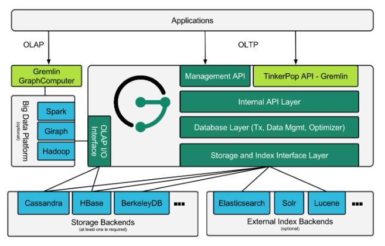

# janusgraph 安装

1. 介绍

   

2. janusgraph 安装

   ```shell
   unzip janusgraph-0.3.1-hadoop2.zip -d /app/deploy/
   mv /app/deploy/janusgraph-0.3.1-hadoop2 /app/deploy/janusgraph-0.3.1
   
   ```

3. 配置环境变量

   > 修改 `/etc/profile`，添加环境变量

   ```shell
   export JANUSGRAPH_HOME=/opt/janusgraph-0.3.1
   export PATH=:$JANUSGRAPH_HOME/bin:$PATH
   ```

   >生效

   ```shell
   . /etc/profile  或  source /etc/profile
   ```

4. 服务配置

   > janusgraph 有两种连接后端存储的方式： 
   - 一种是： 通过gremlin 客户端连接到后端（）。

     > 通过嵌入式方式直接使用方式如下：

     ```groovy
     gremlin> graph = JanusGraphFactory.open('conf/janusgraph-hbase-es.properties')
     ==>standardjanusgraph[hbase:[127.0.0.1]]
     gremlin>
     gremlin> g = graph.traversal()
     ==>graphtraversalsource[standardjanusgraph[hbase:[127.0.0.1]], standard]
     gremlin> g.V().count()
     ==>0
     gremlin>
     ```

     

   - 二种是：启动 janusgraph server 端，gremlin 客户端连接 JanusGraph Server 端，JanusGraph Server 端 来连接后端存储。

     > JanusGraph Server支持 WebSocket和 HTTP访问
     >
     > JanusGraph Server的配置分为两部分：
     - janusgraph-hbase-es-server.properties 
     
     ```shell
       cd /app/deploy/janusgraph-0.3.1/conf/gremlin-server
       cp janusgraph-cassandra-es-server.properties janusgraph-hbase-es-server.properties 
       
     # 修改相对应选项的配置项：
       storage.backend=hbase
       storage.hostname=127.0.0.1
       index.search.backend=elasticsearch
       index.search.hostname=127.0.0.1
       ```
     
       
     
     - gremlin-hbase-es-server.yaml
     
       ```shell
       cd /opt/janusgraph-0.3.1/conf/gremlin-server
       cp gremlin-server.yaml gremlin-hbase-es-server.yaml
       ```
     
       修改 `channelizer`  和 `graphs`
     
       > channelizer是关系访问gremlin-server的方式，它提供了WebSocket和Http两种方式，默认只配置了WebSocket，即 `org.apache.tinkerpop.gremlin.server.channel.WebSocketChannelizer`
       >
       > 改为同时支持两种方式：
       >
       > `channelizer: org.apache.tinkerpop.gremlin.server.channel.WsAndHttpChannelizer`
     
       > 原有配置为：graph: conf/gremlin-server/janusgraph-cql-es-server.properties
       >
       > 修改于下：
       >
       > graph: conf/gremlin-server/janusgraph-hbase-es-server.properties
     
       这里的graph就是你的向Gremlin-Server发送Gremlin查询语言时可以使用的图实例对象。它指向了实例化该图实例的配置文件，就是开始配置的那个文件
     

5. **启动JanusGraph Server**

   ```groovy
   gremlin-server.sh conf/gremlin-server/gremlin-hbase-es-server.yaml
   ```

   说明：这个命令可以在任意目录下执行

6. **JanusGraph Server测试验证**

   上面提到JanusGraph Server支持WebSocket和HTTP访问。下面将通过这两种方式来验证环境的正确性

   - **WebSocket接口验证**

     ```groovy
     [dennis@centos7 ~]$ gremlin.sh
     
     gremlin> :remote connect tinkerpop.server conf/remote.yaml
     ==>Configured localhost/127.0.0.1:8182
     gremlin> :> g.V().count()
     ==>0
     gremlin>
     ```

     g.V().count()是统计当前图数据库中的所有顶点。这里返回值为0.

   - **HTTP接口验证**

     HTTP接口验证要更简单，可以直接在浏览器输入IP地址+端口，后面跟Gremlin查询语言:

     如下：

     http://192.168.43.5:8182/?gremlin=g.V().count()

     返回结果如下：

     ```
     {"requestId":"b2cb112e-db55-4ebe-a04e-1ceaeff89597","status":{"message":"","code":200,"attributes":{"@type":"g:Map","@value":[]}},"result":{"data":{"@type":"g:List","@value":[{"@type":"g:Int64","@value":0}]},"meta":{"@type":"g:Map","@value":[]}}}
     ```

   - 

7. 总结

   下面对JanusGraph 启动流程总结：

   - 启动HBase

     [Hbase 部署](hadoop/hbase.md)

     `start-hbase.sh`

   - 启动ElasticSearch

     [Elasticsearch 部署](elasticsearch/README.md)

     ```
     cd /opt/janusgraph-0.3.1/elasticsearch/
     nohup bin/elasticsearch &
     ```

   - 启动Gremlin-Server

     `nohup gremlin-server.sh conf/gremlin-server/gremlin-hbase-server.yaml &`

8. 操作方式 

   - 通过Gremlin-Server的使用方式如下

     ```groovy
     gremlin> :remote connect tinkerpop.server conf/remote.yaml
     gremlin> :> g.V().count()
     ==>0
     gremlin>
     ```

   - 通过嵌入式方式直接使用方式如下

     ```groovy
     gremlin> graph = JanusGraphFactory.open('conf/janusgraph-hbase-es.properties')
     ==>standardjanusgraph[hbase:[127.0.0.1]]
     gremlin>
     gremlin> g = graph.traversal()
     ==>graphtraversalsource[standardjanusgraph[hbase:[127.0.0.1]], standard]
     gremlin> g.V().count()
     ==>0
     gremlin>
     ```

9. 下章将介绍 JanusGraph 可视化

