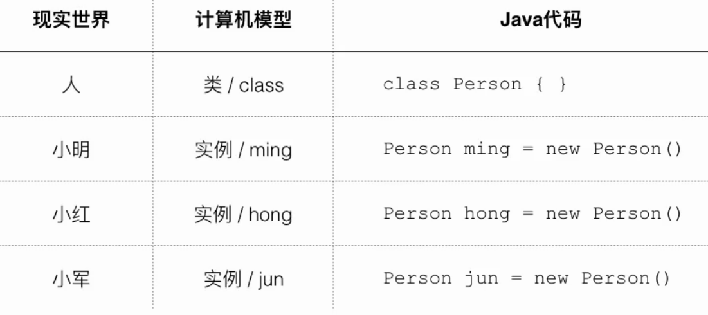

### Java 面向对象编程

- 对象的概念

  

- class / instance

  class 是对象模版

  - class 定义了如何创建实例
  - class 名字就是数据类型

  instance 是对象实例

  - instance 是根据class 创建的实例
  - 可以创建多个 instance
  - 各个instance 类型相同，但各自属性可能不相同

- 

