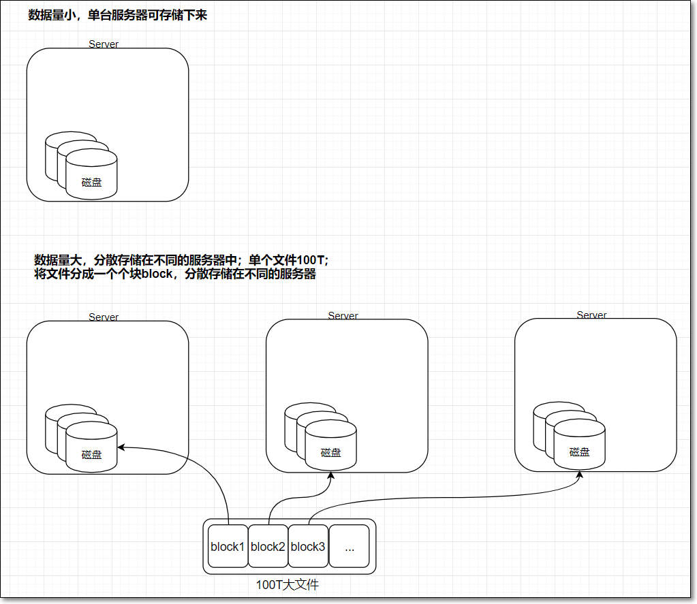
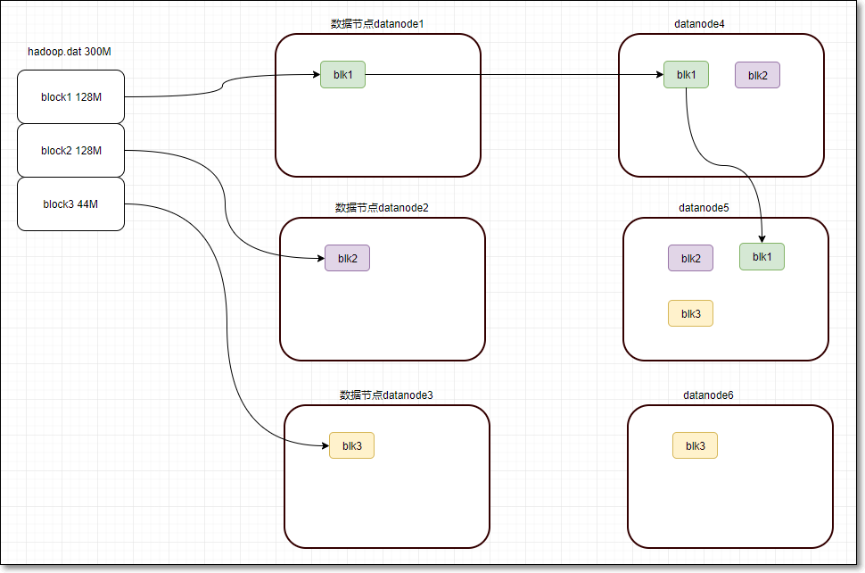
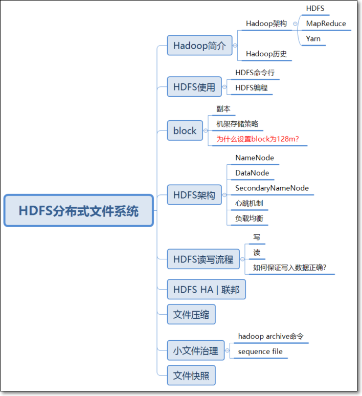

# HDFS分布式文件系统


## 一、课前准备

1. 安装VMware15虚拟化软件 
2. 安装CentOS 7虚拟机3个
3. 安装3节点的hadoop-2.6.0-cdh5.14.2集群
4. 某台虚拟机节点安装图形化界面及IDEA

## 二、课堂主题

本堂课主要围绕HDFS进行讲解。主要包括：

1. 核心概念
2. 架构原理
3. HDFS命令行
4. HDFS读写流程
5. HDFS编程


## 三、课堂目标

1. 理解分布式思想
2. 学会使用HDFS的常用命令
3. 掌握如何使用java api操作HDFS
4. 能独立描述HDFS三大组件namenode、secondarynamenode、datanode的作用
5. 理解并独立描述HDFS读写流程
6. HDFS如何解决大量小文件存储问题？

## 四、知识要点

### 1. Hadoop简介（5分钟）

> 官网：[http://hadoop.apache.org](http://hadoop.apache.org/)

#### 1.1 Hadoop架构

- Hadoop由三个模块组成：**分布式**存储HDFS、分布式计算MapReduce、资源调度引擎Yarn


#### 1.2 Hadoop历史


- Hadoop作者Doug Cutting

- Apache Lucene是一个文本搜索系统库

- Apache Nutch作为前者的一部分，主要包括web爬虫、全文检索；2003年“谷歌分布式文件系统GFS”论文，2004年开源版本**NDFS**

- 2004年“谷歌MapReduce”论文，2005年Nutch开源版MapReduce


### 2.  HDFS是什么（5分钟）

- HDFS是Hadoop中的一个存储子模块

- HDFS (全称Hadoop Distributed File System)，即hadoop的分布式文件系统

- File System**文件系统**：操作系统中负责管理和存储文件信息的软件；具体地说，它负责为用户创建文件，存入、读出、修改、转储、删除文件等

- 当数据集大小超出一台计算机的存储能力时，就有必要将它拆分成若干部分，然后分散到不同的计算机中存储。管理网络中跨多台计算机存储的文件系统称之为**分布式文件系统**（distributed filesystem）

#### 2.1 HDFS特点

**2.1.1 优点：**

- 适合存储大文件，能用来存储管理PB级的数据；不适合存储小文件
- 处理非结构化数据
- 流式的访问数据，一次写入、多次读写
- 运行于廉价的商用机器集群上，成本低
- 高容错：故障时能继续运行且不让用户察觉到明显的中断
- 可扩展



**2.1.2 局限性**

- 不适合处理低延迟数据访问
  - DFS是为了处理大型数据集分析任务的，主要是为达到高的数据吞吐量而设计的
  - 对于低延时的访问需求，HBase是更好的选择
- 无法高效存储大量的小文件
  - 小文件会给Hadoop的扩展性和性能带来严重问题
  - 利用SequenceFile、MapFile等方式归档小文件
- 不支持多用户写入及任意修改文件
  - 文件有一个写入者，只能执行追加操作
  - 不支持多个用户对同一文件的写操作，以及在文件任意位置进行修改

#### 2.2 小结

- HDFS适合存储大文件，不适合存储小文件

- 不适合处理低延时的数据方问


### 3. HDFS初体验

#### 3.1 HDFS命令（15分钟）

- HDFS命令与linux 命令的相似性

- 参考课件《HDFS命令》

#### 3.2 WEB UI界面

- 访问HDFS的web界面，浏览器访问

```
node01:50070
```


#### 3.3 HDFS编程（20分钟）

- HDFS java API编程

  - 如何建MAVEN工程：①pom.xml文件；②建包、建类；

  - 如何编写HDFS读写代码

  - 如何运行代码：

    - 方式①本地运行（代码右键->run）；
    
    - 方式②打包运行：
    
    - 如何打包？两种方式；

    - 方式一：
    
      ```shell
    mvn clean package -DskipTests # 在工程目录下执行
      ```

    - 方式二：利用IDEA图形化界面
    
    
    
    - 运行jar包
    
      ```shell
      [hadoop@node01 target]$ hadoop jar hdfs-1.0-SNAPSHOT.jar com.kaikeba.com.hdfs.FileCopyFromLocal
      ```

- 如何查看官方API文档

  ```
  网址：https://hadoop.apache.org/docs/r2.7.3/api/index.html
  ```

- HDFS代码

  > 写数据

  ```java
  package com.kaikeba.hadoop.hdfs;
  
  import org.apache.hadoop.conf.Configuration;
  import org.apache.hadoop.fs.FileSystem;
  import org.apache.hadoop.fs.Path;
  import org.apache.hadoop.io.IOUtils;
  
  import java.io.*;
  import java.net.URI;
  
  /**
   * 将本地文件系统的文件通过java-API写入到HDFS文件
   */
  public class CopyFileFromLocal {
  
      public static void main(String[] args){
          //本地磁盘路径
          String source="C:/test.txt";
  
          //先确保/data目录存在
          String destination="hdfs://node01:8020/test.txt";//HDFS的路徑
  
          InputStream in = null;
          try {
              in = new BufferedInputStream(new FileInputStream(source));
              //HDFS读写的配置文件
              Configuration conf = new Configuration();
  
              FileSystem fs = FileSystem.get(URI.create(destination),conf);
  
              //调用Filesystem的create方法返回的是FSDataOutputStream对象
              //该对象不允许在文件中定位，因为HDFS只允许一个已打开的文件顺序写入或追加
              OutputStream out = fs.create(new Path(destination));
  
              IOUtils.copyBytes(in, out, 4096, true);
          } catch (FileNotFoundException e) {
              System.out.println("exception");
              e.printStackTrace();
          } catch (IOException e) {
              System.out.println("exception1");
              e.printStackTrace();
          }
  
      }
  }
  ```

  > 读数据

  ```java
  package com.kaikeba.hadoop.hdfs;
  
  import org.apache.hadoop.conf.Configuration;
  import org.apache.hadoop.fs.FSDataInputStream;
  import org.apache.hadoop.fs.FileSystem;
  import org.apache.hadoop.fs.Path;
  import org.apache.hadoop.io.IOUtils;
  
  import java.io.BufferedOutputStream;
  import java.io.FileOutputStream;
  import java.io.IOException;
  import java.net.URI;
  
  /**
   * 从HDFS读取文件
   * 打包运行jar包 [bruce@node01 Desktop]$ hadoop jar com.kaikeba.hadoop-1.0-SNAPSHOT.jar  com.kaikeba.hadoop.hdfs.ReadFileFromHDFS
   */
  public class ReadFileFromHDFS {
  
      public static void main(String[] args) {
          try {
              //源文件
              String srcFile = "hdfs://node01:8020/test.txt";
  
              Configuration conf = new Configuration();
  
              FileSystem fs = FileSystem.get(URI.create(srcFile),conf);
              FSDataInputStream hdfsInStream = fs.open(new Path(srcFile));
  
              //本地文件
              BufferedOutputStream outputStream = new BufferedOutputStream(new FileOutputStream("C:/01 HK/高级03班/test01.txt"));
  
              IOUtils.copyBytes(hdfsInStream, outputStream, 4096, true);
  
          } catch (IOException e) {
              e.printStackTrace();
          }
      }
  }
  ```

#### 3.4 小结

- 学习HDFS命令，学会借助help命令

- 根据HDFS与linux命令的相似性，举一反三

- HDFS API编程时，要学会查看API文档

  

### 4. 核心概念block（20分钟）

#### 4.1 数据块block

**4.1.1 HDFS block块**

- 向HDFS上传文件，是按照128M为单位，切分成一个个block，分散的存储在集群的不同**数据节点**datanode上

- 问：HDFS中一个44M大小的块会不会占据128M的空间？

  - 小于一个块大小的文件不会占据整个块的空间

- 问：这样存储有没有问题？

  

#### **4.2 block副本**

- 因为HDFS是用普通的商用服务器搭建起来的；所以有节点出问题的可能性；

- 那么如果每个block只有一份的话，当block所在的节点宕机后，此block将无法访问，进而导致文件无法完整读取

- 为保正数据的可用及容错，HDFS设计成每个block共有三份，即三个副本

- 如何设置副本数？
  - replication = 3

  - hdfs-site.xml

  ```xml
  <property>
  	<name>dfs.replication</name>
  	<value>3</value>
  </property>
  ```



#### **4.3 机架存储策略**

- 实际机房中，会有**机架**，每个机架上若干服务器


- 第一块：在本机器的HDFS目录下存储Block的第一个副本。
  第二块：在不同Rack(机架，暂且称为r1)的某个DataNode(称为dn2)上存储Block的第二个副本。
  第三块：在dn2所在机架r1下，找一台其它的datanode节点，存储Block的第三个副本。
  更能多副本：随机节点

> 了解下服务器参数：https://item.jd.com/4564487.html
>
> 机架：https://item.jd.com/16829137698.html

#### 4.4 block的一些操作

- 设置文件副本数，有什么用？
  - 数据分块存储和副本的存放，是保证可靠性和高性能的关键
  
  - 方式一：使用命令设置文件副本数；动态生效，不需要重启hadoop集群
  
    ```shell
    hadoop fs -setrep -R 4 /path
    ```
  
  - 方式二：修改配置文件hdfs-site.xml，需要重启hadoop集群才能生效
  
    ```xml
    <property>
    	<name>dfs.replication</name>
    	<value>4</value>
    </property>
    ```

- HDFS提供了fsck命令，用于检查HDFS上文件和目录的健康状态、获取文件的block信息和位置信息

```shell
[hadoop@node01 ~]$ hdfs fsck
```


- 查看文件中损坏的块

```shell
[hadoop@node01 ~]$ hdfs fsck /tmall-201412-1w.csv -list-corruptfileblocks
```


- 查看文件的块基本信息

```shell
hdfs fsck /02-041-0029.mp4 -files -blocks -locations
```


- 删除损坏的文件

```shell
[hadoop@node01 ~]$ hdfs fsck  /tmall-201412-1w.csv -delete
```

#### 4.5 小结

- HDFS上的文件分块存储
- 每个块有3个副本
- 考虑机架存储策略
- 关于block的一些常用命令：hdfs fsck


### 5. HDFS架构（重点 20分钟）


- 大多数分布式框架都是主从架构
- HDFS也是主从架构Master|Slave或称为管理节点|工作节点

#### 5.1 NameNode

**5.1.1 文件系统**

- file system文件系统：操作系统中负责管理和存储文件信息的软件；具体地说，它负责为用户创建文件，存入、读取、修改、转储、删除文件等
- 读文件 =>>找到文件 =>> 在哪 + 叫啥？
- 元数据
  - 关于文件或目录的描述信息，如文件所在路径、文件名称、文件类型等等，这些信息称为文件的元数据metadata
- 命名空间
  - 文件系统中，为了便于管理存储介质上的，给每个目录、目录中的文件、子目录都起了名字，这样形成的层级结构，称之为命名空间
  - 同一个目录中，不能有同名的文件或目录
  - 这样通过目录+文件名称的方式能够唯一的定位一个文件


**5.1.2 HDFS-NameNode**

- HDFS本质上也是文件系统filesystem，所以它也有元数据metadata；
- 元数据metadata保存在NameNode**内存**中
- NameNode作用
  - HDFS的主节点，负责管理文件系统的命名空间，将HDFS的元数据存储在NameNode节点的内存中
  - 负责响应客户端对文件的读写请求
- HDFS元数据
  - 文件目录树、所有的文件（目录）名称、文件属性（生成时间、副本、权限）、每个文件的块列表、每个block块所在的datanode列表
  

  
  - 每个文件、目录、block占用大概**150Byte字节的元数据**；所以HDFS适合存储大文件，不适合存储小文件
  
  - HDFS元数据信息以两种形式保存：①编辑日志**edits log**②命名空间镜像文件**fsimage**
    - edits log：HDFS编辑日志文件 ，保存客户端对HDFS的所有更改记录，如增、删、重命名文件（目录），这些操作会修改HDFS目录树；NameNode会在编辑日志edit日志中记录下来；
    - fsimage：HDFS元数据镜像文件 ，即将namenode内存中的数据落入磁盘生成的文件；保存了文件系统目录树信息以及文件、块、datanode的映射关系，如下图


> 说明：
>
> ①为hdfs-site.xml中属性dfs.namenode.edits.dir的值决定；用于namenode保存edits.log文件
>
> ②为hdfs-site.xml中属性dfs.namenode.name.dir的值决定；用于namenode保存fsimage文件

#### 5.2 DataNode

- DataNode数据节点的作用
  - 存储block以及block元数据到datanode本地磁盘；此处的元数据包括数据块的长度、块数据的校验和、时间戳

#### 5.3 SeconddaryNameNode   

- 为什么引入SecondaryNameNode

  - 为什么元数据存储在NameNode在内存中？

  - 这样做有什么问题？如何解决？

  - HDFS编辑日志文件 editlog：在NameNode节点中的编辑日志editlog中，记录下来客户端对HDFS的所有更改的记录，如增、删、重命名文件（目录）；

  - 作用：一旦系统出故障，可以从editlog进行恢复；

  - 但editlog日志大小会随着时间变在越来越大，导致系统重启根据日志恢复的时候会越来越长；

  - 为了避免这种情况，引入**检查点机制checkpoint**，命名空间镜像fsimage就是HDFS元数据的持久性检查点，即将内存中的元数据落磁盘生成的文件；

  - 此时，namenode如果重启，可以将磁盘中的fsimage文件读入内容，将元数据恢复到某一个检查点，然后再执行检查点之后记录的编辑日志，最后完全恢复元数据。

  - 但是依然，随着时间的推移，editlog记录的日志会变多，那么当namenode重启，恢复元数据过程中，会花越来越长的时间执行editlog中的每一个日志；而在namenode元数据恢复期间，HDFS不可用。

  - 为了解决此问题，引入secondarynamenode辅助namenode，用来合并fsimage及editlog


- SecondaryNameNode定期做checkpoint检查点操作

  - 创建检查点checkpoint的两大条件：
    - SecondaryNameNode每隔1小时创建一个检查点
    - 另外，Secondary NameNode每1分钟检查一次，从上一检查点开始，edits日志文件中是否已包括100万个事务，如果是，也会创建检查点
  - Secondary NameNode首先请求原NameNode进行edits的滚动，这样新的编辑操作就能够进入新的文件中
  - Secondary NameNode通过HTTP GET方式读取原NameNode中的fsimage及edits
  - Secondary NameNode读取fsimage到内存中，然后执行edits中的每个操作，并创建一个新的统一的fsimage文件
  - Secondary NameNode通过HTTP PUT方式将新的fsimage发送到原NameNode
  - 原NameNode用新的fsimage替换旧的fsimage，同时系统会更新fsimage文件到记录检查点的时间。 
  - 这个过程结束后，NameNode就有了最新的fsimage文件和更小的edits文件

- SecondaryNameNode一般部署在另外一台节点上

  - 因为它需要占用大量的CPU时间
  - 并需要与namenode一样多的内存，来执行合并操作

- 如何查看edits日志文件

  ```shell
  hdfs oev -i edits_0000000000000000256-0000000000000000363 -o /home/hadoop/edit1.xml
  ```

- 如何查看fsimage文件

  ```shell
  hdfs oiv -p XML -i fsimage_0000000000000092691 -o fsimage.xml  
  ```

- checkpoint相关属性

  | 属性                                 | 值              | 解释                                                         |
  | ------------------------------------ | --------------- | ------------------------------------------------------------ |
  | dfs.namenode.checkpoint.period       | 3600秒(即1小时) | The number of seconds between two periodic checkpoints.      |
| dfs.namenode.checkpoint.txns         | 1000000         | The Secondary NameNode or CheckpointNode will create a checkpoint of the namespace every 'dfs.namenode.checkpoint.txns' transactions, regardless of whether 'dfs.namenode.checkpoint.period' has expired. |
  | dfs.namenode.checkpoint.check.period | 60(1分钟)       | The SecondaryNameNode and CheckpointNode will poll the NameNode every 'dfs.namenode.checkpoint.check.period' seconds to query the number of uncheckpointed transactions. |
  
  

#### 5.4 心跳机制


**工作原理：**

1. NameNode启动的时候，会开一个ipc server在那里
2. DataNode启动后向NameNode注册，每隔**3秒钟**向NameNode发送一个“**心跳heartbeat**”
3. 心跳返回结果带有NameNode给该DataNode的命令，如复制块数据到另一DataNode，或删除某个数据块
4. 如果超过**10分钟**NameNode没有收到某个DataNode 的心跳，则认为该DataNode节点不可用
5. DataNode周期性（**6小时**）的向NameNode上报当前DataNode上的块状态报告BlockReport；块状态报告包含了一个该 Datanode上所有数据块的列表

**心跳的作用：**

1. 通过周期心跳，NameNode可以向DataNode返回指令

2. 可以判断DataNode是否在线

3. 通过BlockReport，NameNode能够知道各DataNode的存储情况，如磁盘利用率、块列表；跟**负载均衡**有关

4. hadoop集群刚开始启动时，99.9%的block没有达到最小副本数(dfs.namenode.replication.min默认值为1)，集群处于**安全模式**，涉及BlockReport；

**心跳相关配置**

- [hdfs-default.xml](<https://hadoop.apache.org/docs/r2.7.0/hadoop-project-dist/hadoop-hdfs/hdfs-default.xml>)
- 心跳间隔

| 属性                   | 值   | 解释                                               |
| ---------------------- | ---- | -------------------------------------------------- |
| dfs.heartbeat.interval | 3    | Determines datanode heartbeat interval in seconds. |

- **block report**

| More Actions属性             | 值               | 解释                                                 |
| ---------------------------- | ---------------- | ---------------------------------------------------- |
| dfs.blockreport.intervalMsec | 21600000 (6小时) | Determines block reporting interval in milliseconds. |

- 查看hdfs-default.xml默认配置文件


#### 5.5 负载均衡

- 什么原因会有可能造成不均衡？
  - 机器与机器之间磁盘利用率不平衡是HDFS集群非常容易出现的情况
  - 尤其是在DataNode节点出现故障或在现有的集群上增添新的DataNode的时候

- 为什么需要均衡？
  - 提升集群存储资源利用率
  - 从存储与计算两方面提高集群性能

- 如何手动负载均衡？

```shell
$HADOOP_HOME/sbin/start-balancer.sh -t 5%	# 磁盘利用率最高的节点若比最少的节点，大于5%，触发均衡
```

#### 5.6 小结

- NameNode负责存储元数据，存在内存中
- DataNode负责存储block块及块的元数据
- SecondaryNameNode主要负责对HDFS元数据做checkpoint操作
- 集群的心跳机制，让集群中各节点形成一个整体；主节点知道从节点的死活
- 节点的上下线，导致存储的不均衡，可以手动触发负载均衡


## 五、拓展点、未来计划、行业趋势（5分钟）


## 六、总结（5分钟）



## 七、作业


## 八、互动问答


## 九、题库 - 本堂课知识点

