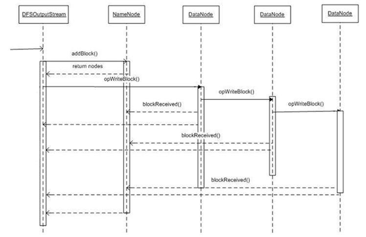
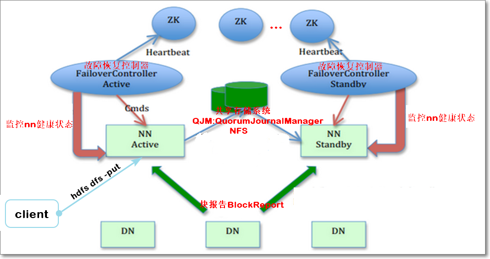
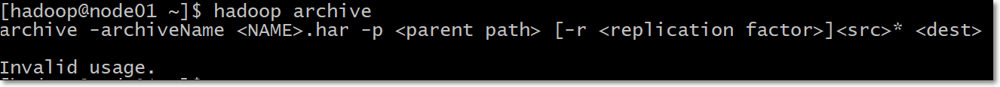
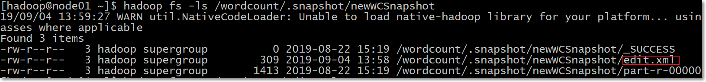

# HDFS分布式文件系统

### 6. HDFS读写流程（重点 30分钟）


#### 6.1 数据写流程




**6.1.1 详细流程**

- 创建文件：	

  - HDFS客户端向HDFS写数据，先调用DistributedFileSystem.create()方法，在HDFS创建新的空文件
  - RPC（ClientProtocol.create()）远程过程调用NameNode（NameNodeRpcServer）的create()，首先在HDFS目录树指定路径添加新文件
  - 然后将创建新文件的操作记录在editslog中
  - NameNode.create方法执行完后，DistributedFileSystem.create()返回FSDataOutputStream，它本质是封装了一个DFSOutputStream对象

- 建立数据流管道：

  - 客户端调用DFSOutputStream.write()写数据
  - DFSOutputStream调用ClientProtocol.addBlock()，首先向NameNode申请一个空的数据块
  - addBlock()返回LocatedBlock对象，对象包含当前数据块的所有datanode的位置信息
  - 根据位置信息，建立数据流管道

- 向数据流管道pipeline中写当前块的数据：

  - 客户端向流管道中写数据，先将数据写入一个检验块chunk中，大小512Byte，写满后，计算chunk的检验和checksum值（4Byte）
  - 然后将chunk数据本身加上checksum，形成一个带checksum值的chunk（516Byte）
  - 保存到一个更大一些的结构**packet数据包**中，packet为64kB大小
- packet写满后，先被写入一个**dataQueue**队列中
  - packet被从队列中取出，向pipeline中写入，先写入datanode1，再从datanoe1传到datanode2，再从datanode2传到datanode3中
- 一个packet数据取完后，后被放入到**ackQueue**中等待pipeline关于该packet的ack的反馈
  - 每个packet都会有ack确认包，逆pipeline（dn3 -> dn2 -> dn1）传回输出流
- 若packet的ack是SUCCESS成功的，则从ackQueue中，将packet删除；否则，将packet从ackQueue中取出，重新放入dataQueue，重新发送
  - 如果当前块写完后，文件还有其它块要写，那么再调用addBlock方法（**流程同上**）
- 文件最后一个block块数据写完后，会再发送一个空的packet，表示当前block写完了，然后关闭pipeline
  - 所有块写完，close()关闭流
- ClientProtocol.complete()通知namenode当前文件所有块写完了

**6.1.2 容错**

- 在写的过程中，pipeline中的datanode出现故障（如网络不通），输出流如何恢复
  - 输出流中ackQueue缓存的所有packet会被重新加入dataQueue
  - 输出流调用ClientProtocol.updateBlockForPipeline()，为block申请一个新的时间戳，namenode会记录新时间戳
  - 确保故障datanode即使恢复，但由于其上的block时间戳与namenode记录的新的时间戳不一致，故障datanode上的block进而被删除
  - 故障的datanode从pipeline中删除
  - 输出流调用ClientProtocol.getAdditionalDatanode()通知namenode分配新的datanode到数据流pipeline中，并使用新的时间戳建立pipeline
  - 新添加到pipeline中的datanode，目前还没有存储这个新的block，HDFS客户端通过DataTransferProtocol通知pipeline中的一个datanode复制这个block到新的datanode中
  - pipeline重建后，输出流调用ClientProtocol.updatePipeline()，更新namenode中的元数据
  - 故障恢复完毕，完成后续的写入流程

#### 6.2 数据读流程

**6.2.1 基本流程**


- 1、client端读取HDFS文件，client调用文件系统对象DistributedFileSystem的open方法
- 2、返回FSDataInputStream对象（对DFSInputStream的包装）
- 3、构造DFSInputStream对象时，调用namenode的getBlockLocations方法，获得file的开始若干block（如blk1, blk2, blk3, blk4）的存储datanode（以下简称dn）列表；针对每个block的dn列表，会根据网络拓扑做排序，离client近的排在前；
- 4、调用DFSInputStream的read方法，先读取blk1的数据，与client最近的datanode建立连接，读取数据
- 5、读取完后，关闭与dn建立的流
- 6、读取下一个block，如blk2的数据（重复步骤4、5、6）
- 7、这一批block读取完后，再读取下一批block的数据（重复3、4、5、6、7）
- 8、完成文件数据读取后，调用FSDataInputStream的close方法

**6.2.2 容错**

- 情况一：读取block过程中，client与datanode通信中断

  - client与存储此block的第二个datandoe建立连接，读取数据
  - 记录此有问题的datanode，不会再从它上读取数据

-  情况二：client读取block，发现block数据有问题
   -  client读取block数据时，同时会读取到block的校验和，若client针对读取过来的block数据，计算检验和，其值与读取过来的校验和不一样，说明block数据损坏
   -  client从存储此block副本的其它datanode上读取block数据（也会计算校验和）
   -  同时，client会告知namenode此情况；


#### 6.3 源码剖析

- 实战项目“Hadoop二次开发”会具体展开分析

#### 6.4 小结


### 7. Hadoop HA高可用（10分钟）

#### 7.1 HDFS高可用原理



- 对于HDFS ，NN存储元数据在内存中，并负责管理文件系统的命名空间和客户端对HDFS的读写请求。但是，如果只存在一个NN，一旦发生“单点故障”，会使整个系统失效。
- 虽然有个SNN，但是它并不是NN的热备份
- 因为SNN无法提供“热备份”功能，在NN故障时，无法立即切换到SNN对外提供服务，即HDFS处于停服状态。
- HDFS2.x采用了HA（High Availability高可用）架构。
  - 在HA集群中，可设置两个NN，一个处于“活跃（Active）”状态，另一个处于“待命（Standby）”状态。
  - 由zookeeper确保一主一备（讲zookeeper时具体展开）
  - 处于Active状态的NN负责响应所有客户端的请求，处于Standby状态的NN作为热备份节点，保证与active的NN的元数据同步
  - Active节点发生故障时，zookeeper集群会发现此情况，通知Standby节点立即切换到活跃状态对外提供服务
  - 确保集群一直处于可用状态
- 如何热备份元数据：
  - Standby NN是Active NN的“热备份”，因此Active NN的状态信息必须实时同步到StandbyNN。
  - 可借助一个共享存储系统来实现状态同步，如NFS(NetworkFile System)、QJM(Quorum Journal Manager)或者Zookeeper。
  - Active NN将更新数据写入到共享存储系统，Standby NN一直监听该系统，一旦发现有新的数据写入，就立即从公共存储系统中读取这些数据并加载到Standby NN自己内存中，从而保证元数据与Active NN状态一致。
- 块报告：
  - NN保存了数据块到实际存储位置的映射信息，为了实现故障时的快速切换，必须保证StandbyNN中也包含最新的块映射信息
  - 因此需要给所有DN配置Active和Standby两个NN的地址，把块的位置和心跳信息同时发送到两个NN上。

#### 7.2 小结


### 8. Hadoop联邦（10分钟）

#### 8.1 为什么需要联邦

- 虽然HDFS HA解决了“单点故障”问题，但HDFS在扩展性、整体性能和隔离性方面仍有问题
  - 系统扩展性方面，元数据存储在NN内存中，受限于内存上限（每个文件、目录、block占用约150字节）
  - 整体性能方面，吞吐量受单个NN的影响
  - 隔离性方面，一个程序可能会影响其他程序的运行，如果一个程序消耗过多资源会导致其他程序无法顺利运行
  - HDFS HA本质上还是单名称节点

#### 8.2 联邦


- HDFS联邦可以解决以上三个问题
  - HDFS联邦中，设计了多个命名空间；每个命名空间有一个NN或一主一备两个NN，使得HDFS的命名服务能够水平扩展
  - 这些NN分别进行各自命名空间namespace和块的管理，相互独立，不需要彼此协调
  - 每个DN要向集群中所有的NN注册，并周期性的向所有NN发送心跳信息和块信息，报告自己的状态
  - HDFS联邦每个相互独立的NN对应一个独立的命名空间
  - 每一个命名空间管理属于自己的一组块，这些属于同一命名空间的块对应一个“块池”的概念。
  - 每个DN会为所有块池提供块的存储，块池中的各个块实际上是存储在不同DN中的

#### 8.3 扩展

[联邦-官网](<https://hadoop.apache.org/docs/r2.7.3/hadoop-project-dist/hadoop-hdfs/Federation.html>)

#### 8.4 小结


### 9. 文件压缩（15分钟）

#### 9.1 压缩算法

- 文件压缩好处：
  - 减少数据所占用的磁盘空间
  - 加快数据在磁盘、网络上的IO

- 常用压缩格式

  | 压缩格式 | UNIX工具 | 算      法 | 文件扩展名 | 可分割 |
  | -------- | -------- | ---------- | ---------- | ------ |
  | DEFLATE  | 无       | DEFLATE    | .deflate   | No     |
  | gzip     | gzip     | DEFLATE    | .gz        | No     |
  | zip      | zip      | DEFLATE    | .zip       | YES    |
  | bzip     | bzip2    | bzip2      | .bz2       | YES    |
  | LZO      | lzop     | LZO        | .lzo       | No     |
  | Snappy   | 无       | Snappy     | .snappy    | No     |

- Hadoop的压缩实现类；均实现CompressionCodec接口

  | 压缩格式 | 对应的编码/解码器                          |
  | -------- | ------------------------------------------ |
  | DEFLATE  | org.apache.hadoop.io.compress.DefaultCodec |
  | gzip     | org.apache.hadoop.io.compress.GzipCodec    |
  | bzip2    | org.apache.hadoop.io.compress.BZip2Codec   |
  | LZO      | com.hadoop.compression.lzo.LzopCodec       |
  | Snappy   | org.apache.hadoop.io.compress.SnappyCodec  |

- 查看集群是否支持本地压缩（所有节点都要确认）

  ```
  [hadoop@node01 ~]$ hadoop checknative
  ```

  

#### 9.2 编程实践

- 编程：上传压缩过的文件到HDFS

  - 对CopyFileFromLocal代码做修改，向文件压缩后，再上传到HDFS
  - 代码

```java
package com.kaikeba.hadoop.compress;

import org.apache.hadoop.conf.Configuration;
import org.apache.hadoop.fs.FileSystem;
import org.apache.hadoop.fs.Path;
import org.apache.hadoop.io.IOUtils;
import org.apache.hadoop.io.compress.BZip2Codec;
import org.apache.hadoop.io.compress.CompressionCodec;
import org.apache.hadoop.io.compress.CompressionOutputStream;
import org.apache.hadoop.util.ReflectionUtils;

import java.io.*;
import java.net.URI;

/**
 *
 * 将本地文件系统的文件通过java-API写入到HDFS文件，并且写入时使用压缩
 */
public class CopyFileFromLocal {

    /**
     *
     * @param args 两个参数 C:\test\01_018分钟.mp4 hdfs://node01:8020/copyFromLocal/01_018分钟.bz2
     * @throws ClassNotFoundException
     */
    public static void main(String[] args) throws ClassNotFoundException {

        //压缩相关
        //压缩类
        //HDFS读写的配置文件
        Configuration conf = new Configuration();
        BZip2Codec codec = new BZip2Codec();
        codec.setConf(conf);

        String source = args[0]; //linux或windows中的文件路徑,demo存在一定数据

        String destination="hdfs://node01:8020/copyFromLocal/01_018分钟.bz2";//HDFS的路徑

        InputStream in = null;
        try {
            in = new BufferedInputStream(new FileInputStream(source));

            FileSystem fs = FileSystem.get(URI.create(destination),conf);

            //调用Filesystem的create方法返回的是FSDataOutputStream对象
            //该对象不允许在文件中定位，因为HDFS只允许一个已打开的文件顺序写入或追加
            OutputStream out = fs.create(new Path(destination));
            //对输出流的数据压缩
            CompressionOutputStream compressedOut = codec.createOutputStream(out);

            //流拷贝
            IOUtils.copyBytes(in, compressedOut, 4096, true);
        } catch (FileNotFoundException e) {
            System.out.println("exception");
            e.printStackTrace();
        } catch (IOException e) {
            System.out.println("exception1");
            e.printStackTrace();
        }
    }
}
```

- 扩展阅读
  - 《Hadoop权威指南》 5.2章节 压缩
  - [HDFS文件压缩](<https://blog.csdn.net/qq_38262266/article/details/79171524>)

#### 9.3 小结


### 10. 小文件治理（20分钟）

#### 10.1 HDFS不适合存储小文件

- NameNode存储着文件系统的元数据，每个文件、目录、块大概有150字节的元数据；
- NN内存有限，因此HDFS存储文件数量的也有上限，如果小文件过多则会造成NN的压力过大
- 且HDFS能存储的数据总量也会变小

#### 10.2 HAR文件方案（10分钟）

- 此方案本质启动mr程序，所以需要启动yarn


用法：hadoop archive -archiveName <NAME>.har -p <parent path> [-r <replication factor>]<src>* <dest>




```shell
# 创建archive文件；/testhar有两个子目录th1、th2；两个子目录中有若干文件
hadoop archive -archiveName test.har -p /testhar -r 3 th1 th2 /outhar # 原文件还存在，需手动删除

# 查看archive文件
hdfs dfs -ls -R har:///outhar/test.har

# 解压archive文件
# 方式一
hdfs dfs -cp har:///outhar/test.har/th1 hdfs:/unarchivef1 # 顺序解压
hadoop fs -ls /unarchivef1	
# 方式二
hadoop distcp har:///outhar/test.har/th1 hdfs:/unarchivef2 # 并行解压，效率高，启动MR
```

#### 10.3 Sequence Files方案（重点 15分钟）


- SequenceFile文件，主要由一条条record记录组成；
- 具体结构（如上图）：
  - 一个SequenceFile首先有一个4字节的header（文件版本号）
  - 接着是若干record记录
  - 每个record是键值对形式的；键值类型是可序列化类型，如IntWritable、Text
  - 记录间会随机的插入一些同步点sync marker，用于方便定位到记录边界
- SequenceFile文件可以作为小文件的存储容器；
  - 每条record保存一个小文件的内容
  - 小文件名作为当前record的键；
  - 小文件的内容作为当前record的值；
  - 如10000个100KB的小文件，可以编写程序将这些文件放到一个SequenceFile文件。
- 一个SequenceFile是**可分割**的，所以MapReduce可将文件切分成块，每一块独立操作。
- 不像HAR，SequenceFile**支持压缩**。记录的结构取决于是否启动压缩
  - 支持两类压缩：
    - 不压缩NONE，如上图
    - 压缩RECORD，如上图
    - 压缩BLOCK，如下图，①一次性压缩多条记录；②每一个新块Block开始处都需要插入同步点
  - 在大多数情况下，以block（注意：指的是SequenceFile中的block）为单位进行压缩是最好的选择
  - 因为一个block包含多条记录，利用record间的相似性进行压缩，压缩效率更高
  - 把已有的数据转存为SequenceFile比较慢。比起先写小文件，再将小文件写入SequenceFile，一个更好的选择是直接将数据写入一个SequenceFile文件，省去小文件作为中间媒介.


- 向SequenceFile写入数据

```java
package com.kaikeba.hadoop.sequencefile;

import org.apache.hadoop.conf.Configuration;
import org.apache.hadoop.fs.FileSystem;
import org.apache.hadoop.fs.Path;
import org.apache.hadoop.io.IOUtils;
import org.apache.hadoop.io.IntWritable;
import org.apache.hadoop.io.SequenceFile;
import org.apache.hadoop.io.Text;
import org.apache.hadoop.io.compress.BZip2Codec;

import java.io.IOException;
import java.net.URI;

public class SequenceFileWriteNewVersion {

    //模拟数据源；数组中一个元素表示一个文件的内容
    private static final String[] DATA = {
            "The Apache Hadoop software library is a framework that allows for the distributed processing of large data sets across clusters of computers using simple programming models.",
            "It is designed to scale up from single servers to thousands of machines, each offering local computation and storage.",
            "Rather than rely on hardware to deliver high-availability, the library itself is designed to detect and handle failures at the application layer",
            "o delivering a highly-available service on top of a cluster of computers, each of which may be prone to failures.",
            "Hadoop Common: The common utilities that support the other Hadoop modules."
    };

    public static void main(String[] args) throws IOException {
        //输出路径：要生成的SequenceFile文件名
        String uri = "hdfs://node01:8020/writeSequenceFile";

        Configuration conf = new Configuration();
        FileSystem fs = FileSystem.get(URI.create(uri), conf);
        //向HDFS上的此SequenceFile文件写数据
        Path path = new Path(uri);

        //因为SequenceFile每个record是键值对的
        //指定key类型
        IntWritable key = new IntWritable(); //key数字 -> int -> IntWritable
        //指定value类型
        Text value = new Text();//value -> String -> Text

        //创建向SequenceFile文件写入数据时的一些选项
        //要写入的SequenceFile的路径
        SequenceFile.Writer.Option pathOption       = SequenceFile.Writer.file(path);
        //record的key类型选项
        SequenceFile.Writer.Option keyOption        = SequenceFile.Writer.keyClass(IntWritable.class);
        //record的value类型选项
        SequenceFile.Writer.Option valueOption      = SequenceFile.Writer.valueClass(Text.class);
        //SequenceFile压缩方式：NONE | RECORD | BLOCK三选一
        //方案一：RECORD、不指定压缩算法
//        SequenceFile.Writer.Option compressOption   = SequenceFile.Writer.compression(SequenceFile.CompressionType.RECORD);
//        SequenceFile.Writer writer = SequenceFile.createWriter(conf, pathOption, keyOption, valueOption, compressOption);


        //方案二：BLOCK、不指定压缩算法
//        SequenceFile.Writer.Option compressOption   = SequenceFile.Writer.compression(SequenceFile.CompressionType.BLOCK);
//        SequenceFile.Writer writer = SequenceFile.createWriter(conf, pathOption, keyOption, valueOption, compressOption);


        //方案三：使用BLOCK、压缩算法BZip2Codec；压缩耗时间
        //再加压缩算法
        BZip2Codec codec = new BZip2Codec();
        codec.setConf(conf);
        SequenceFile.Writer.Option compressAlgorithm = SequenceFile.Writer.compression(SequenceFile.CompressionType.RECORD, codec);
        //创建写数据的Writer实例
        SequenceFile.Writer writer = SequenceFile.createWriter(conf, pathOption, keyOption, valueOption, compressAlgorithm);

        for (int i = 0; i < 100000; i++) {
            //分别设置key、value值
            key.set(100000 - i);
            value.set(DATA[i % DATA.length]); //%取模 3 % 3 = 0;
            System.out.printf("[%s]\t%s\t%s\n", writer.getLength(), key, value);
            //在SequenceFile末尾追加内容
            writer.append(key, value);
        }
        //关闭流
        IOUtils.closeStream(writer);
    }
}
```

- 命令查看SequenceFile内容

```shell
 hadoop fs -text /writeSequenceFile
```

- 读取SequenceFile文件

```java
package com.kaikeba.hadoop.sequencefile;

import org.apache.hadoop.conf.Configuration;
import org.apache.hadoop.fs.Path;
import org.apache.hadoop.io.IOUtils;
import org.apache.hadoop.io.SequenceFile;
import org.apache.hadoop.io.Writable;
import org.apache.hadoop.util.ReflectionUtils;

import java.io.IOException;

public class SequenceFileReadNewVersion {

    public static void main(String[] args) throws IOException {
        //要读的SequenceFile
        String uri = "hdfs://node01:8020/writeSequenceFile";
        Configuration conf = new Configuration();
        Path path = new Path(uri);

        //Reader对象
        SequenceFile.Reader reader = null;
        try {
            //读取SequenceFile的Reader的路径选项
            SequenceFile.Reader.Option pathOption = SequenceFile.Reader.file(path);

            //实例化Reader对象
            reader = new SequenceFile.Reader(conf, pathOption);

            //根据反射，求出key类型对象
            Writable key = (Writable)
                    ReflectionUtils.newInstance(reader.getKeyClass(), conf);
            //根据反射，求出value类型对象
            Writable value = (Writable)
                    ReflectionUtils.newInstance(reader.getValueClass(), conf);

            long position = reader.getPosition();
            System.out.println(position);

            while (reader.next(key, value)) {
                String syncSeen = reader.syncSeen() ? "*" : "";
                System.out.printf("[%s%s]\t%s\t%s\n", position, syncSeen, key, value);
                //移动到下一个record开头的位置
                position = reader.getPosition(); // beginning of next record
            }
        } finally {
            IOUtils.closeStream(reader);
        }
    }
}
```

#### 10.4 小结


### 11. 文件快照（10分钟）

#### 11.1 什么是快照

- 快照比较常见的应用场景是数据备份，以防一些用户错误或灾难恢复
- 快照snapshots是HDFS文件系统的，只读的、某时间点的拷贝
- 可以针对某个目录，或者整个文件系统做快照
- 创建快照时，block块并不会被拷贝。快照文件中只是记录了block列表和文件大小，**不会做任何数据拷贝**

#### 11.2 快照操作

- 允许快照

  允许一个快照目录被创建。如果这个操作成功完成，这个目录就变成snapshottable

  用法：hdfs dfsadmin -allowSnapshot <snapshotDir>

  ```shell
  hdfs dfsadmin -allowSnapshot /wordcount
  ```

- 禁用快照

  用法：hdfs dfsadmin -disallowSnapshot <snapshotDir>

  ```shell
  hdfs dfsadmin -disallowSnapshot /wordcount
  ```

- 创建快照(snapshotDir必须是snapshottable)

  用法：hdfs dfs -createSnapshot <snapshotDir> [<snapshotName>]

  ```shell
  #注意：先将/wordcount目录变成允许快照的
  hdfs dfs -createSnapshot /wordcount wcSnapshot
  ```

- 查看快照

  ```shell
  hdfs dfs -ls /wordcount/.snapshot
  ```

  

- 重命名快照

  这个操作需要拥有snapshottabl目录所有者权限

  用法：hdfs dfs -renameSnapshot <snapshotDir> <oldName> <newName>

  ```shell
  hdfs dfs -renameSnapshot /wordcount wcSnapshot newWCSnapshot
  ```

- 用快照恢复误删除数据

  HFDS的/wordcount目录，文件列表如下

  

  误删除/wordcount/edit.xml文件

  ```shell
  hadoop fs -rm /wordcount/edit.xml
  ```

  

  恢复数据

  ```shell
  hadoop fs -cp /wordcount/.snapshot/newWCSnapshot/edit.xml /wordcount
  ```

- 删除快照

  这个操作需要拥有snapshottabl目录所有者权限

  用法：hdfs dfs -deleteSnapshot <snapshotDir> <snapshotName>

  ```shell
  hdfs dfs -deleteSnapshot /wordcount newWCSnapshot
  ```

#### 11.3 小结


## 五、拓展点、未来计划、行业趋势（5分钟）

1. HDFS存储地位

2. **block块为什么设置的比较大(面试)**

- [磁盘基础知识](<https://www.cnblogs.com/jswang/p/9071847.html>)	
  - 盘片platter、磁头head、磁道track、扇区sector、柱面cylinder
  - 为了最小化寻址开销；从磁盘传输数据的时间明显大于定位这个块开始位置所需的时间
- 问：块的大小是不是设置的越大越好呢？


3. 扩展阅读：《HDFS新特性》

4. 参考书籍：《Hadoop权威指南 第4版》

   

## 六、总结（5分钟）


## 七、作业


## 八、互动问答


## 九、题库 - 本堂课知识点

- HDFS命令中“1.  HDFS基本操作”

- 使用IDEA创建一个maven工程
  - 利用java编程，向HDFS上传文件
  - 利用java编程，向HDFS上传文件，且上传到HDFS的文件是经过压缩后的
  - 利用java编程，从HDFS下载文件

- 描述向HDFS上传文件的流程及画图（可用笔画，手机拍照或使用画图软件，如https://www.draw.io/或https://processon.com/）

- 描述从HDFS下载文件的流程及画图

- SequenceFile读写编程