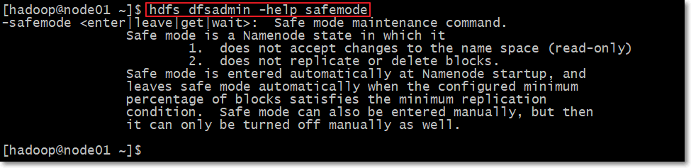

# HDFS命令

## 1. hdfs基本操作（15分钟）

> HDFS命令有两种风格：
>
> ​	hadoop fs开头的
>
> ​	hdfs dfs开头的
>
> 两种命令均可使用，效果相同


### 1.1 常用命令

1. 如何查看hdfs或hadoop子命令的**帮助信息**，如ls子命令

   ```shell
   hdfs dfs -help ls
   hadoop fs -help ls	#两个命令等价
   ```

2. **查看**hdfs文件系统中已经存在的文件。对比linux命令ls

   ```shell
   hdfs dfs -ls /
   hadoop fs -ls /
   ```

3. 在hdfs文件系统中创建文件

   ```shell
   hdfs dfs -touchz /edits.txt
   ```

4. 向HDFS文件中追加内容

    ```shell
    hadoop fs -appendToFile edit1.xml /edits.txt #将本地磁盘当前目录的edit1.xml内容追加到HDFS根目录 的edits.txt文件
    ```

5. 查看HDFS文件内容

    ```shell
    hdfs dfs -cat /edits.txt
    ```

6. **从本地路径上传文件至HDFS**

    ````` shell
    #用法：hdfs dfs -put /本地路径 /hdfs路径
    hdfs dfs -put hadoop-2.7.3.tar.gz /
    hdfs dfs -copyFromLocal hadoop-2.7.3.tar.gz /  #根put作用一样
    hdfs dfs -moveFromLocal hadoop-2.7.3.tar.gz /  #根put作用一样，只不过，源文件被拷贝成功后，会被删除
    `````

7. **在hdfs文件系统中下载文件**

     ```shell
     hdfs dfs -get /hdfs路径 /本地路径
     hdfs dfs -copyToLocal /hdfs路径 /本地路径  #根get作用一样
     ```

8. 在hdfs文件系统中**创建目录**

     ```shell
     hdfs dfs -mkdir /shell
     ```

9. 在hdfs文件系统中**删除**文件

     ```shell
     hdfs dfs -rm /edits.txt
     hdfs dfs -rm -r /shell
     ```

10. 在hdfs文件系统中**修改文件名称**（也可以用来**移动**文件到目录）

     ```shell
     hdfs dfs -mv /xcall.sh /call.sh
     hdfs dfs -mv /call.sh /shell
     ```

11. 在hdfs中拷贝文件到目录

      ```shell
      hdfs dfs -cp /xrsync.sh /shell
      ```

12. 递归删除目录

      ```shell
      hdfs dfs -rmr /shell
      ```

13. 列出本地文件的内容（默认是hdfs文件系统）

      ```shell
      hdfs dfs -ls file:///home/bruce/
      ```

14. 查找文件

      ```shell
      # linux find命令
      find . -name 'edit*'
      
      # HDFS find命令
      hadoop fs -find / -name part-r-00000 # 在HDFS根目录中，查找part-r-00000文件
      ```

      

> 还有许多其他命令，大家可以自己探索一下   

### 1.2 总结

- 输入hadoop fs 或hdfs dfs，回车，查看所有的HDFS命令

- 许多命令与linux命令有很大的相似性，学会举一反三
- 有用的help，如查看ls命令的使用说明：hadoop fs -help ls


## 2. hdfs与getconf结合使用

1. 获取NameNode的节点名称（可能有多个）

      ``````shell
      hdfs getconf -namenodes
      ``````

2. 获取hdfs最小块信息

      ``````shell
      hdfs getconf -confKey dfs.namenode.fs-limits.min-block-size
      ``````

3. 查找hdfs的NameNode的RPC地址

	``````shell
	hdfs getconf -nnRpcAddresses
	``````
	
	

## 3. hdfs与dfsadmin结合使用

1. 同样要学会借助帮助信息

      ```shell
      hdfs dfsadmin -help safemode
      ```

      

2. 查看hdfs dfsadmin的帮助信息

      ``````shell
      hdfs dfsadmin
      ``````

3. 查看当前的模式

      ``````shell
      hdfs dfsadmin -safemode get
      ``````

4. 进入安全模式

  ``````shell
  hdfs dfsadmin -safemode enter
  ``````

  

## 4. hdfs与fsck结合使用

1. fsck指令**显示HDFS块信息**

	``````shell
	hdfs fsck /02-041-0029.mp4 -files -blocks -locations # 查看文件02-041-0029.mp4的块信息
	``````
	
	

## 5. 其他命令

1. 检查压缩库本地安装情况

      ``````shell
      hadoop checknative
      ``````

2. 格式化名称节点（**慎用**，一般只在初次搭建集群，使用一次；格式化成功后，不要再使用）

      ``````shell
      hadoop namenode -format
      ``````

3. 执行自定义jar包

   ``````shell
   hadoop jar YinzhengjieMapReduce-1.0-SNAPSHOT.jar com.kaikeba.hadoop.WordCount /world.txt /out
   ``````