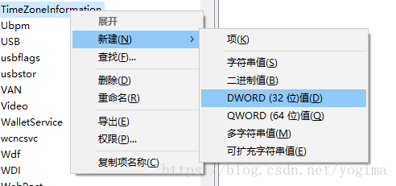

### 解决Windows装了ubuntu双系统后系统时间错误问题

1. 在windows下win+R并输入regedit打开注册表

2. 找到HKEY_LOCAL_MACHINE/SYSTEM/CurrentControlSet/Control/TimeZoneInformation/，右键新建DWORD（32位）值

   

3. 将其名称叫做RealTimeIsUniversal，值设置为1

   

4. 更正时间，然后重启