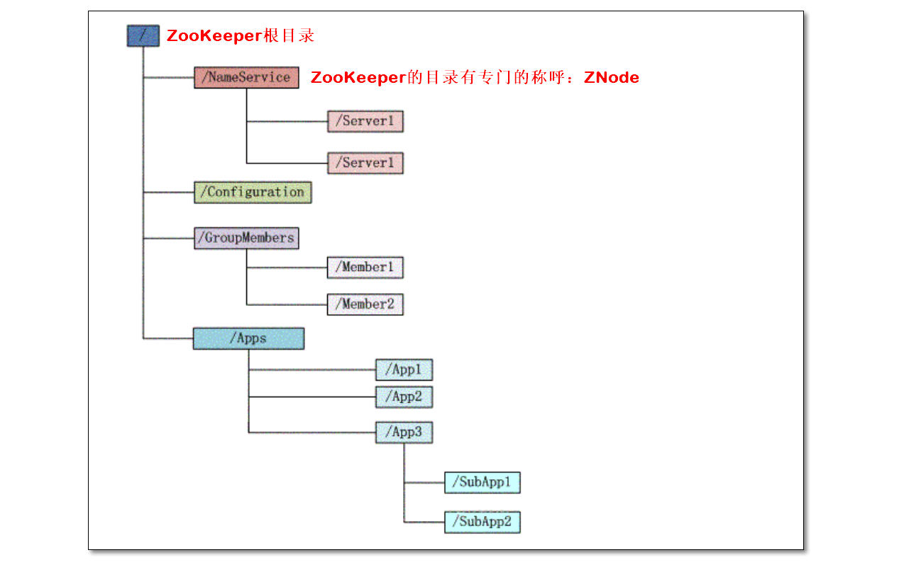

# ZooKeeper分布式协调框架

# 一、课前准备

1. 准备三台虚拟机，搭建3节点ZooKeeper集群

2. 安装和配置好IDEA开发工具

# 二、课堂主题

主要围绕ZooKeeper进行讲解

1. 讲解ZooKeeper是什么？

2. 介绍ZooKeeper的核心概念、运行机制

3. ZooKeeper 命令行应用

4. ZooKeeper Java编程实战

# 三、课堂目标

1. 学会ZooKeeper的基本使用：命令行、Java编程
2. 理解ZooKeeper watcher监听器工作原理：注册、监听事件、回调函数（考点）
3. 能独立描述出ZooKeeper选举过程（难点、考点）
4. 理解、并讲述客户端从ZooKeeper读写的过程（考点）


# 四、知识要点

## 1. 为什么要用ZooKeeper（5分钟）

- 分布式框架多个独立的程序协同工作比较复杂
  - 开发人员容易花较多的精力实现如何使多个程序协同工作的逻辑
  - 导致没有时间更好的思考实现程序本身的逻辑
  - 或者开发人员对程序间的协同工作关注不够，造成协调问题
  - 且这个分布式框架中协同工作的逻辑是共性的需求
- ZooKeeper简单易用，能够很好的解决分布式框架在运行中，出现的各种协调问题。比如集群master主备切换、节点的上下线感知、统一命名服务、状态同步服务、集群管理、分布式应用配置项的管理等等


## 2. 什么是ZooKeeper?（5分钟）

- 是Google的Chubby的一个开源实现版
- ZooKeeper
  - 一个分布式的，开源的，用于分布式应用程序的协调服务（service）
  - 主从架构
- Zookeeper 作为一个分布式的服务框架
  - 主要用来解决分布式集群中应用系统的一致性问题
  - 它能提供基于类似于文件系统的**目录节点树**方式的数据存储，
  - Zookeeper 作用主要是用来维护和监控存储的数据的状态变化，通过监控这些数据状态的变化，从而达到基于数据的集群管理


## 3. ZooKeeper应用初体验

> 从下图观察：ZooKeeper集群目前有两种角色：leader、follower；
>
> ZooKeeper集群也是主从架构的：leader为主；follower为从


> 通过客户端操作ZooKeeper集群，有两种类型的客户端
>
> ①命令行zkCli
>
> ②Java编程

### 3.1 zkCli命令行（30分钟）

- 集群命令（**每个节点运行此命令**）


```shell
# 启动ZooKeeper集群；在ZooKeeper集群中的每个节点执行此命令
${ZK_HOME}/bin/zkServer.sh start
# 停止ZooKeeper集群（每个节点执行以下命令）
${ZK_HOME}/bin/zkServer.sh stop
# 查看集群状态（每个节点执行此命令）
${ZK_HOME}/bin/zkServer.sh status
```

- 客户端连接zkServer服务器


```shell
# 使用ZooKeeper自带的脚本，连接ZooKeeper的服务器
zkCli.sh -server node01:2181,node02:2181,node03:2181
```

> -server选项后指定参数node01:2181,node02:2181,node03:2181
>
> 客户端随机的连接三个服务器中的一个

- 客户端发出对ZooKeeper集群的读写请求
  
  - ZooKeeper集群中有类似于linux文件系统的一个简版的文件系统；目录结构也是树状结构（目录树）
  


  - 重要技巧：<font color='red'>不会就喊**help**</font>
  
  - 还记得其它框架中help的使用吗？


- 常用命令

```shell
#查看ZooKeeper根目录/下的文件列表
ls /
```


```shell
#创建节点，并指定数据
create /kkb	kkb
```

```shell
#获得某节点的数据
get /kkb
```


```shell
#修改节点的数据
set /kkb kkb01

#删除节点
delete /kkb
```


### 3.2 Java API编程（重点 30分钟）

> IDE可以是eclipse，或IDEA；此处以IDEA演示
>
> 编程分两类：原生API编程；curator编程

- [Curator官网](< http://curator.apache.org/ >)
- Curator编程
  - Curator对ZooKeeper的api做了封装，提供简单易用的api；
  - 它的风格是Curator链式编程
  - 参考《使用curator做zk编程》
- 代码详见工程代码

### 3.3 总结


## 4.基本概念和操作（25分钟）

> 分布式通信有几种方式
>
> 1、直接通过网络连接的方式进行通信；
>
> 2、通过共享存储的方式，来进行通信或数据的传输
>
> ZooKeeper使用第二种方式，提供分布式协调服务

### 4.1 ZooKeeper数据结构

> ZooKeeper主要由以下三个部分实现

**ZooKeeper=①简版文件系统(Znode)+②原语+③通知机制(Watcher)。**

- ZK文件系统
  - 基于类似于文件系统的**目录节点树**方式的数据存储
- 原语
  - 可简单理解成ZooKeeper的基本的命令
- Watcher（监听器）





### **4.2 数据节点**ZNode

**4.2.1 什么是ZNode**

- ZNode 分为四类：

|            | 持久节点  | 临时节点     |
| ---------- | --------- | ------------ |
| 非有序节点 | create    | create -e    |
| 有序节点   | create -s | create -s -e |

**4.2.2 持久节点**

- 类比，文件夹

```shell
# 创建节点/zk_test，并设置数据my_data
create /zk_test my_data
# 持久节点，只有显示的调用命令，才能删除永久节点
delete /zk_test
```

**4.2.3 临时节点**

- 临时节点的生命周期跟客户端**会话**session绑定，一旦会话失效，临时节点被删除。

```shell
# client1上创建临时节点
create -e /tmp tmpdata

# client2上查看client1创建的临时节点
ls /

# client1断开连接
close

# client2上观察现象，发现临时节点被自动删除
ls /
```

**4.2.4 有序节点**

- ZNode也可以设置为**有序节点**

- 为什么设计临时节点？
  
- 防止多个不同的客户端在同一目录下，创建同名ZNode，由于重名，导致创建失败
  
- 如何创建临时节点

   - 命令行使用-s选项：create -s /kkb kkb

   - Curator编程，可添加一个特殊的属性：CreateMode.EPHEMERAL

      

- 一旦节点被标记上这个属性，那么在这个节点被创建时，ZooKeeper 就会自动在其节点后面追加上一个整型数字

   - 这个整数是一个由父节点维护的自增数字。
   - 提供了创建唯一名字的ZNode的方式

   ```shell
   # 创建持久、有序节点
   create -s /test01 test01-data
   # Created /test010000000009
   ```


### 4.3 会话（Session)


**4.4.1 什么是会话** 

- 客户端要对ZooKeeper集群进行读写操作，得先与某一ZooKeeper服务器建立TCP长连接；此TCP长连接称为建立一个会话Session。

- 每个会话有超时时间：SessionTimeout
  - 当客户端与集群建立会话后，如果超过SessionTimeout时间，两者间没有通信，会话超时

**4.4.2 会话的特点**

- 客户端打开一个Session中的请求以FIFO（先进先出）的顺序执行；
  - 如客户端client01与集群建立会话后，先发出一个create请求，再发出一个get请求；
  - 那么在执行时，会先执行create，再执行get
- 若打开两个Session，无法保证Session间，请求FIFO执行；只能保证一个session中请求的FIFO

**4.4.3 会话的生命周期**


- 会话的生命周期
  - 未建立连接
  - 正在连接
  - 已连接
  - 关闭连接

### **4.4 请求**

- 读写请求
  - 通过客户端向ZooKeeper集群中写数据
  - 通过客户端从ZooKeeper集群中读数据


### 4.5 事务zxid

- 事务
  - 客户端的写请求，会对ZooKeeper中的数据做出更改；如增删改的操作
  - 每次写请求，会生成一次事务
  - 每个事务有一个全局唯一的事务ID，用 ZXID 表示；全局自增

- 事务特点
  - ACID：
  - 原子性atomicity | 一致性consistency | 隔离性isolation | 持久性durability

- ZXID结构：
  - 通常是一个64位的数字。由**epoch+counter**组成
  - epoch、counter各32位


### 4.6 Watcher监视与通知 

**4.6.1 为什么要有Watcher**

- 问：客户端如何获取ZooKeeper服务器上的最新数据？
  - **方式一**轮询：ZooKeeper以远程服务的方式，被客户端访问；客户端以轮询的方式获得znode数据，效率会比较低（代价比较大）

  

  - **方式二**基于通知的机制：
    - 客户端在znode上注册一个Watcher监视器
    - 当znode上数据出现变化，watcher监测到此变化，通知客户端

  

- 对比，那种好？

**4.6.2 什么是Watcher?**

- 客户端在服务器端，注册的事件监听器；
- watcher用于监听znode上的某些事件
  - 比如znode数据修改、节点增删等；
  - 当监听到事件后，watcher会触发通知客户端

**4.6.3 如何设置Watcher**

> 注意：**Watcher是一个<font color='red'>单次触发的操作</font>**

- 可以设置watcher的命令如下：


- **示例1**

```shell
#ls path [watch]
#node01 上执行
ls /zk_test watch

#node02 上执行
create /zk_test/dir01 dir01-data

#观察node-01上变化
[zk: node-01:2181,node-02:2181,node-03:2181(CONNECTED) 87] 
WATCHER::

WatchedEvent state:SyncConnected type:NodeChildrenChanged path:/zk_test
```

图示：

- client1上执行步骤1

- client2上执行步骤2；

- client1上观察现象3


- **示例2**

```shell
#监控节点数据的变化；
#node02上
get /zk_test watch

#node03上
set /zk_test "junk01"
#观察node2上cli的输出，检测到变化
```

- **示例3**：节点上下线监控

  - **原理：**

    1. 节点1（client1）创建临时节点
    2. 节点2（client2）在临时节点，注册监听器watcher
    3. 当client1与zk集群断开连接，临时节点会被删除
    4. watcher发送消息，通知client2，临时节点被删除的事件

  - **用到的zk特性：**

    ​	Watcher+临时节点

  - **好处：**

    ​	通过这种方式，检测和被检测系统不需要直接关联（如client1与client2），而是通过ZK上的某个节点进行关联，大大减少了系统**耦合**。

  - **实现：**

    client1操作

    ```shell
    # 创建临时节点
    create -e /zk_tmp tmp-data
    ```

    client2操作

    ```shell
    # 在/zk_tmp注册监听器
    ls /zk_tmp watch
    ```

    client1操作

    ```shell
    # 模拟节点下线
    close
    ```

    观察client2

    ```shell
    WATCHER::
    
    WatchedEvent state:SyncConnected type:NodeDeleted path:/zk_tmp
    ```

  - **图示：**

    client1：

    

    client2：


### 4.7 总结


## 5. ZooKeeper工作原理（5分钟）

- ZooKeeper使用原子广播协议叫做Zab(ZooKeeper Automic Broadcast)协议
- Zab协议有两种模式
  - **恢复模式（选主）**：因为ZooKeeper也是主从架构；当ZooKeeper集群没有主的角色leader时，从众多服务器中选举leader时，处于此模式
  - **广播模式（同步）**：当集群有了leader后，客户端向ZooKeeper集群读写数据时，集群处于此模式
- 为了保证事务的顺序一致性，ZooKeeper采用了递增的事务id号（zxid）来标识事务，所有提议（proposal）都有zxid


# 五、拓展点、未来计划、行业趋势

## 6. ZooKeeper应用场景（15分钟）

- ZooKeeper应用场景


1. NameNode使用ZooKeeper实现高可用.
2. Yarn ResourceManager使用ZooKeeper实现高可用.
3. 利用ZooKeeper对HBase集群做高可用配置
4. kafka使用ZooKeeper
   - 保存消息消费信息比如offset.
   - 用于检测崩溃
   - 主题topic发现
   - 保持主题的生产和消费状态

   
   

## 7. 访问控制ACL（10分钟）

- 参考《访问控制ACL》


# 六、总结（5分钟）


# 七、作业


# 八、互动问答


# 九、题库 - 本堂课知识点

1. 假设五台ZooKeeper服务器，分别为zk1,zk2,zk3,zk4,zk5，sid分别为1、2、3、4、5，依次启动zk1,zk2,zk3,zk4,zk5。问哪台是leader，为什么这台是leader?
3. 同一个客户端同时发起多次请求操作时ZooKeeper内部是如何操作的？多个客户端同时发起多个请求时又是如何操作的？
3. 自己编写代码，完成zookeeper原生API下的增加节点、删除节点、修改节点等操作；其中一个自定义的方法要用到监听器
4. 使用curator API完成增加节点、删除节点、修改节点等操作；其中一个自定义的方法要用到监听器
