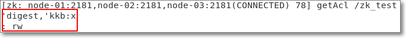
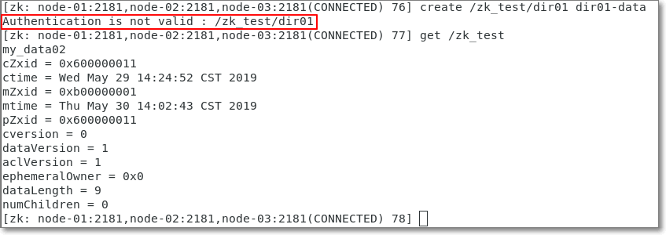

#### 5.8 ACL访问控制列表

##### 5.8.1 为什么要用ACL

zk做为分布式架构中的重要中间件，通常会在上面以节点的方式存储一些关键信息，默认情况下，所有应用都可以读写任何节点，在复杂的应用中，这不太安全，ZK通过ACL机制来解决访问权限问题

##### 5.8.2 何为ACL

ACL(Access Control List)可以设置某些客户端，对zookeeper服务器上节点的权限，如增删改查等

##### 5.8.2 ACL种类

ZooKeeper 采用 ACL（Access Control Lists）策略来进行权限控制。ZooKeeper 定义了如下5种权限。

- CREATE: 创建**子节点**的权限。

- READ: 获取节点数据和子节点列表的权限。

- WRITE：更新节点数据的权限。

- DELETE: 删除**子节点**的权限。

- ADMIN: 设置节点ACL的权限。

>  注意：CREATE 和 DELETE 都是针对子节点的权限控制。

##### 5.8.3 如何设置ACL

1. 五种权限简称

- CREATE -> 增 -> c
- READ -> 查 -> r
- WRITE -> 改 -> w
- DELETE -> 删 -> d
- ADMIN -> 管理 -> a
- 这5种权限简写为**crwda**

2. 鉴权模式

- world：默认方式，相当于全世界都能访问
- auth：代表已经认证通过的用户(cli中可以通过addauth digest user:pwd 来添加当前上下文中的授权用户)
- digest：即用户名:密码这种方式认证，这也是业务系统中最常用的
- ip：使用Ip地址认证

3. 演示auth方式

```shell
# 1）增加一个认证用户
# addauth digest 用户名:密码明文
addauth digest kkb:kkb

# 2）设置权限
# setAcl /path auth:用户名:密码明文:权限
setAcl /zk_test auth:kkb:kkb:rw

# 3）查看ACL设置
getAcl /zk_test
```



4. 问：如何解释下图命令的执行效果？   

