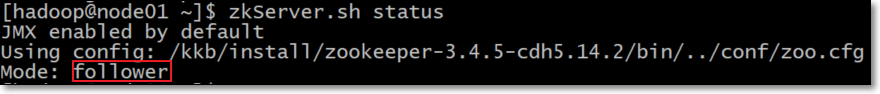

# zookeeper-3.4.5-cdh5.14.2安装部署

## 1. 三台机器安装zookeeper集群

> 注意事项：**三台机器一定要保证时钟同步**

### 1.1 下载zookeeeper的压缩包，下载网址如下

- http://archive.cloudera.com/cdh5/cdh/5/

- 我们在这个网址下载我们使用的zk版本为[zookeeper-3.4.5-cdh5.14.2.tar.gz](http://archive.cloudera.com/cdh5/cdh/5/zookeeper-3.4.5-cdh5.14.2.tar.gz)

- 下载完成之后，上传到我们的node01的/kkb/soft路径下准备进行安装

### 1.2 解压

- node01执行以下命令解压zookeeper的压缩包到node01服务器的/kkb/install路径下去，然后准备进行安装

```shell
cd /kkb/soft

tar -zxvf zookeeper-3.4.5-cdh5.14.2.tar.gz  -C /kkb/install/
```


### 1.3 修改配置文件

- 第一台机器修改配置文件

```shell
cd /kkb/install/zookeeper-3.4.5-cdh5.14.2/conf

cp zoo_sample.cfg zoo.cfg

mkdir -p /kkb/install/zookeeper-3.4.5-cdh5.14.2/zkdatas
```

- 用vim  zoo.cfg修改文件，修改如下属性值

```shell
dataDir=/kkb/install/zookeeper-3.4.5-cdh5.14.2/zkdatas

autopurge.snapRetainCount=3

autopurge.purgeInterval=1

#文件末尾增加如下三行
server.1=node01:2888:3888
server.2=node02:2888:3888
server.3=node03:2888:3888
```


### 1.4 添加myid配置

- 在第一台机器的/kkb/install/zookeeper-3.4.5-cdh5.14.2/zkdatas/这个路径下创建一个文件，文件名为myid ,文件内容为1

```shell
echo 1 >  /kkb/install/zookeeper-3.4.5-cdh5.14.2/zkdatas/myid
```

 

### 1.5 安装包分发并修改myid的值

- 第一台机器上面执行以下两个命令

```shell
scp -r /kkb/install/zookeeper-3.4.5-cdh5.14.2/ node02:/kkb/install/

scp -r /kkb/install/zookeeper-3.4.5-cdh5.14.2/ node03:/kkb/install/
```

- 第二台机器上修改myid的值为2；直接在第二台机器任意路径执行以下命令

```shell
echo 2 > /kkb/install/zookeeper-3.4.5-cdh5.14.2/zkdatas/myid
```

- 第三台机器上修改myid的值为3；直接在第三台机器任意路径执行以下命令

```shell
echo 3 > /kkb/install/zookeeper-3.4.5-cdh5.14.2/zkdatas/myid
```


 ### 1.6 配置环境变量

- 三台节点都配置/etc/profile文件

```shell
export ZK_HOME=/kkb/install/zookeeper-3.4.5-cdh5.14.2
export PATH=$PATH:$ZK_HOME/bin
```

- 三台节点，让新添环境变量生效（hadoop用户下执行）

```shell
source /etc/profile
```


### 1.7 三台机器启动zookeeper服务

- 三台机器启动zookeeper服务；这个命令三台机器都要执行

```shell
zkServer.sh start
```

-  查看启动状态

```
zkServer.sh status
```

> 一个zkServer的状态要么是follower，要么是leader
>
> 三个节点中，一个节点为leader，另外两个为follower，类似下图



.png)

### 1.8 如何关闭zookeeper集群

- 三个节点运行

```shell
zkServer.sh stop
```

> **注意：**关闭虚拟机前，要在每个zookeeper服务器中使用zkServer.sh stop命令，关闭zookeeper服务器
>
> 否则，可能集群出问题


